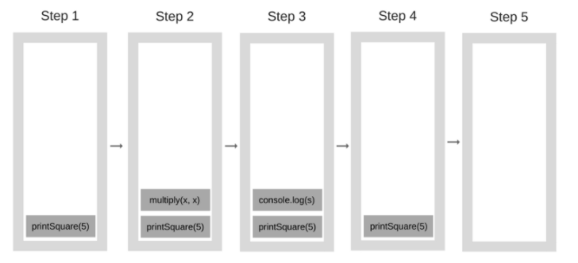
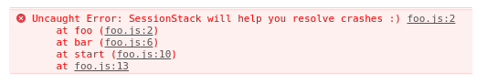

# 자바스크립트 엔진


## 🤔 자바스크립트 엔진?

---

**자바스크립트 엔진**은 주로 `가상머신`이라 불린다.

- 가상머신
  
    특정 컴퓨터 시스템을 소프트웨어 기반으로 에뮬레이션 한 것으로, 얼마나 정확하게 실제의 물리적 머신을 에뮬레이션 할 수 있느냐에 따라 분류된다.

**자바스크립트 엔진**은 자바스크립트 코드를 해석하고 실행하기 위해 만들어진 일종의 프로세스 가상 머신이다.

자바스크립트 엔진의 대표적인 예로는 Goggle의 V8엔진이 있다.
(V8엔진은 Chrome과 Node.js에서 사용한다.)

## 🙄 자바스크립트 엔진이 하는일이 뭐야?

---

**자바스크립트 엔진**의 기본적인 역할은

> 개발자가 작성한 자바스크립트 코드를 브라우저에 의해 해석되거나 어플리케이션에 임베드 될 수 있는 빠르고 최적화된 코드로 변환하는 일이다.
즉, 자바스크립트 코드를 읽고 컴파일한다.

엔진은 자바스크립트로 작성된 소스코드를 가져와서,

문자열 단위로 분해하고, 이들 문자열을 가져다가 컴파일러가 이해할 수 있도록 바이트 코드로 변환한 후 이를 실행한다.
(구글의 V8엔진은 C++로 작성되어있다. V8역시 코드를 컴파일 및 실행하며, 메모리를 할당하고 가비지 컬렉팅을 한다.)

## 🤨 엔진의 구조도

---

간단하게 나타낸 구조이다.


- Memory Heap: 메모리 할당이 일어나는 곳
- Call Stack: 코드 실행에 따라 호출 스택이 쌓이는 곳

## 😗 런타임

---

setTimeout과 같은 브라우저 내장 API는 사실 자바스크립트 엔진에서 제공하는 것이 아니다.

```jsx
console.log('hi1')
setTimeout(()=>{console.log('hi2'},2000)
console.log('hi3')
```

실제로 이렇게 코드를 작성하고 실행했을 때,

우리는 hi1이 먼저 출력되고 다음으로는 hi3 그리고 hi2가 실행되는 것을 확인해 볼 수 있다.
(hi1 > hi3 > hi2)

이를 파헤치기 위해선 작동원리를 조금 알 필요가 있다.


위 그림처럼, 자바스크립트 엔진 이외에도 자바스크립트에 관여하는 다른 요소들이 굉장히 많이 있다.

DOM, Ajax, setTimeout과 같이 브라우저에서 제공하는 API들을 Web API라고 하고 아래쪽에 보면 이벤트 루프와 콜백 큐도 있다.

### 🎈 호출 스택(Call Stack)

자바스크립트는 기본적으로 `싱글 쓰레드 기반 언어`이다.

즉, Call Stack이 하나이기 때문에 한 번에 한 작업만 처리할 수 있다.
(한 번에 한 줄의 코드씩만!!)

호출 스택은 기본적으로 우리가 프로그램 상에서 어디에 있는 지를 기록하는 자료구조이다.
만약, 함수를 실행하면 해당 함수는 **Call Stack**의 가장 상단에 위치하게 된다.
함수의 실행이 끝날 때(리턴 값을 돌려줄 때), 해당 함수를 Call Stack에서 제거한다.
이게 Stack의 역할이다.
(스택은 First In Last Out 구조인 점에 유의하자)

```jsx
function multiply(x, y) {
	return x * y;
}

function printSquare(x) {
	let s = multiply(x, x);
	console.log(s);
}

printSquare(5);
```

뭐 이런 코드가 있었다고 하자.

처음 엔진이 이 코드를 실행하는 시점에는 Call Stack이 비어있다.
하지만, 코드가 실행되면서 Call Stack은 아래와 같이 변한다.



Call Stack의 각 단계를 Stack Frame(스택 프레임)이라고 한다.

그리고 보통 예외가 발생했을 때 콘솔 로그 상에서 나타나는 Stack Trace(스택 트레이스)가 오류가 발생하기 까지의 Stack Trace들로 구성된다.

즉, 에러가 났을 때의 Call Stack 단계를 의미하는 것이다.

예를 들면,

```jsx
function foo() {
    throw new Error('SessionStack will help you resolve crashes :)');
}
function bar() {
    foo();
}
function start() {
    bar();
}
start();
```

이런 코드를 실행 시켰을 때,



이렇게 에러가 나는 것을 볼 수 있다.

결론적으론 2번째 줄에서 에러가 났으며, 그 밑에는 Stack Trace가 오류 발생까지의 길을 추적해주는 것이다.

추가적으로, Call Stack이 최대 크기가 되면 '**스택 날려버리기**'가 발생한다.

```jsx
function foo() {
	foo()
}
foo();
```

이렇게 foo라는 함수를 재귀로 계속 호출하게 되면


Call Stack에 지속적으로 쌓이게 되면서 특정 시점에 최대 허용치를 넘게 되면 브라우저는 


이런 에러를 발생시킨다.

앞서 싱글 스레드는 코드를 실행하는 스택이 하나라고 말했었다.

위에서 살펴 본 것과 같이 싱글 스레드에서 코드를 실행하는 것은 멀티 스레드 환경에 비해 상당히 제약이 많이 있는 것으로 보여진다.

이렇게 한 개의 호출 스택을 갖고 있는 자바스크립트의 실행이 느려지면 아마 속이 터질 것이고 지금과 같이 각광받는 하나의 언어로 성장하지 못했을 것이다.


### 🎈 블로킹 & 논-블로킹

**✨ 블로킹**

싱글 스레드는 스택이 하나이기 때문에, 한 번에 한가지 일 밖에 할 수 없다.

예를 들어서 네트워크 요청을 한다면 응답이 올 때 까지 다른 일은 하지 못하고 기다릴 수 밖에 없는 것이다.

이것이 문제 될 수 밖에 없는 이유는....

웹 브라우저에서 한 코드가 실행되는데, 해당 코드가 종료될때 까지 유저가 어떠한 요청을 해도 무반응이 되는 것이다.

사용자에게 원활한 UI를 제공해야 한다면, 콜 스택이 멈추게 해서는 안된다.

즉, 콜 스택이 멈춘 상태를 `블로킹` 상태라고 한다.

**✨ 논-블로킹**

```jsx
console.log('hi')

setTimeout(function() {
  console.log('there')
}, 5000)

console.log('bye')
```

위 코드는 hi를 먼저 출력하고 5초를 기다리는 것이 아니라, 5초 후 호출되는 비동기 콜백으로 블로킹 문제를 해결할 수 있다.

어떻게 setTimeout의 콜백 함수가 호출되는지는 밑의 내용에서 더 자세히 살펴보겠다.


### 🎈 동시성(Concurrency) & 이벤트 루프(Event Loop)

만약 Call Stack에 어마어마하게 오래 걸리는 함수가 있다고 해보자.

뭐.. 예를 들어서 setTimeout을 1시간으로 해두었다고 가정했을 때,

Call Stack에서 해당 setTimeout 함수가 실행되는 1시간 동안 브라우저는 아무 작업도 못하고 대기 상태가 될 것이다.
즉, 브라우저는 페이지를 그리지도 못하고, 어느 코드도 실행을 못하고 가만히 있게 된다.

사용자들에게 빠른 UI를 제공하는 데에 있어서 크나 큰 결점이 된다.

뿐만 아니라, 브라우저가 Call Stack에서 너무 복잡하고 많은 작업들을 처리하게 되면 화면은 오랫동안 응답을 하지 않게 되고,
결국에는 에러 메시지를 띄우면서 현재 페이지에 대기할 것인지 종료할 것이지 묻는 창이 뜰 것이다.


뭐 이런 창을 한두번 본 적이 있을 것이다.

사용자들에게 이런 창을 보여준다는 것은 되도록 피해야 한다.

그렇다면 어떻게 페이지 렌더링 동작을 방해받지 않고 코드를 효율적으로 실행할 수 있을까?

다행히 이러한 싱글 쓰레드(Single Thread)의 한계를 보완해줄 방법으로

`비동기 콜백(asynchronous callback)`이 존재한다.

자바스크립트는 비동기 콜백을 통해서 한번에 여러가지 일을 처리할 수 있게 된다.

자바스크립트가 실행되는 런타임에는 자바스크립트 엔진에 더하여 이벤트 루프(Event Loop)도 있는데, 이 이벤트 루프를 통해 자바스크립트는 동시에 여러가지 일을 할 수 있게 된다.

✨ **Concurrency model(동시성 모델)**

Event Loop를 기반으로 자바스크립트는 동시에 여러가지 일을 하게 되는데

이를 비동기가 가능해졌다고 말할 수 있다.

(동기는 요청을 보냈을 때, 하염없이 응답을 기다리는 것이며
비동기는 요청을 보내고 응답이 오기 전까지 다른 작업을 하는 것)

모델은 전반적으로 이런 구조이다.


- Call Stack
    - 위에서 살펴봤던 그 Call Stack이다.
- Web API
    - JS엔진이 아닌 브라우저 영역에서 제공하는 API이다.
    - setTimeout(), DOM events 그리고 Ajax로 데이터를 가져오는 시간이 소요되는 일들을 처리한다.
    - 예로, Call Stack에서 setTimeout을 실행하는 함수를 만나게 되면 Web API로 보내서 실행을 맡긴다.
- Task Queue
    - 콜백 함수가 대기하는 Queue 형태의 자료 구조이다.
    - Call Stack(혹은 main thread)가 끝난 후 실행되어 후속 js코드가 차단되는 것을 방지한다.
    - Call Stack에서 Web API 영역으로 보낸 setTimeout()의 실행이 끝나면 바로 Call Stack으로 돌아가는 것이 아니라 Task Queue 영역에 가서 불러주길 기다린다.
- Event Loop
    - Call Stack이 비어 있는지 여부를 확인한다.
    - 비어있을 경우 Task Queue에서 실행 대기중인 콜백함수가 있는지 확인을 한다.
    - 있다면 가장 앞에 있는 콜백을 Call Stack으로 push한다.

아래의 코드로 전반적인 흐름을 보면,

```jsx
console.log('hi1')
setTimeout(()=>{console.log('hi2'},2000)
console.log('hi3')
```


- 먼저 hi1이 Call Stack에 들어가게 된다.
- 그리고 hi1은 바로 실행되어서 빠져나가고
- 다음으로 hi2가 Call Stack으로 들어오게 된다.
- 이때 hi2는 setTimeout 함수를 갖고 있기 때문에 자바스크립트는 이 함수의 실행을 Web API로  넘기고
- 비어있는 Call Stack을 바로 다음 줄 코드인 hi3으로 채워 넣는다.


- 그리고 hi3은 실행이 되어 바로 빠져나가고
- hi2는 Web API에서 2초간 시간을 보낸 뒤 Task Queue로 가서 콜백을 기다린다.
- Event Loop는 계속 돌면서 Call Stack 이 비어있는지 확인하고 hi2를 Task Queue에서 Call Stack으로 push한다.
- 그리고 hi2를 실행 시킨 뒤 Call Stack은 역할을 끝마친다.

이런 흐름으로 설명할 수 있을 것 같다.

결국, setTimeout은 그냥 2초를 기다리는 것이 아니라 Web API로 빠진 뒤 TaskQueue로 들어가는 시간이 2초라는 뜻이다.

무튼 `Event Loop`는 Call Stack과 Task Queue를 지속적으로 모니터링 하면서 비동기적으로 코드가 실행 될 수 있도록 해준다.

자바스크립트 앱 실행 중 서버에서 필요한 데이터를 가지고 오는 비동기 요청이 있다고 했을 때,
이 때 이벤트 루프는 브라우저에게

"지금 자바스크립트 엔진이 이 함수를 실행하면 시간이 너무 오래 걸리니, 브라우저야 너가 네트워크 통신이 끝나고 데이터가 준비되면 그때 콜백을 할께!!"

라고 하는 격이다.


