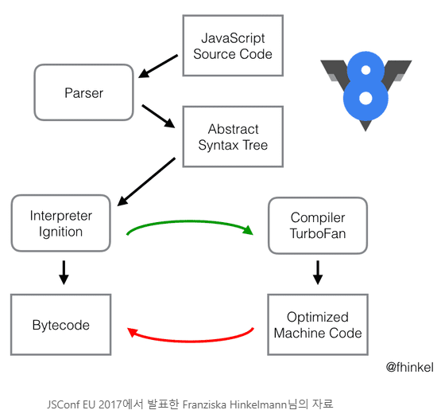
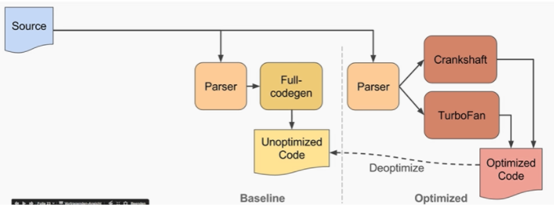
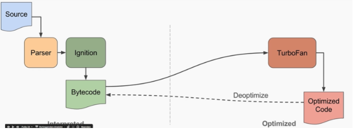

## 😗 V8엔진

------

### 🎈 V8이 만들어진 이유?

자바스크립트를 조금 더 빠르게 효율적으로 웹 브라우저 상에서 실행시키기 위해 탄생되었다.

### 🎈 V8?

- V8은 구글에서 C++로 만든 오픈소스이다. (MicroSoft는 Chakra, Mozila는 SpiderMonkey)
- V8은 자바스크립트 엔진 중 하나로 크롬 웹 브라우저와 Node.js 에서 사용되고 있다.
- 자바스크립트 코드를 더 효율적인 기계 코드로 전환한다.
- SpiderMonkey 또는 Rhino(Mozilla)와 같은 많은 최신 자바스크립트 엔진과 마찬가지로 `JIT(Just-In-Time)컴파일러` 를 구현하여 자바스크립트 코드 실행 시 기계어로 컴파일한다.
- V8은 자바스크립트와 웹어셈블리(WebAssembly)엔진이다.

> *웹어셈블리?? C나 C++와 같은 프로그래밍 언어를 컴파일해서 어느 브라우저에서나 빠르게 실행되는 형식으로 바꿔주는 기술을 말한다. 보통 웹 어플리케이션 개발시에는 JavaScript 프로그래밍 언어를 사용해 동적인 부분을 개발하는 C나 C++언어들에 비해서는 느리다. 게임이나 동영상 편집 등과 같은 고성능 웹 애플리케이션을 개발할 때 브라우저의 동작을 빠르게 하기 위해서 C나 C++와 같은 언어로 개발할 수 있게 하는 것이다. 고성능 웹 애플리케이션 개발 시 자바스크립트와 같이 사용되고, 자바스크립트를 대체하는것이 아니라 보완하는 기술이다.

### 🎈 작동원리



1. JS 코드를 가져와서 가장 먼저 파서(Parser)에게 넘긴다.

2. 파서(Parser)는 소스 코드를 분석한 후 AST(Abstract Syntax Tree, 추상 구문 트리)로 변환시킨다.

3. AST를 Ignition에게 넘긴다.

4. Ignition은 자바스크립트를 바이트 코드(Bytecode)로 변환하는 인터프리터이다.

   4-1. 컴퓨터가 해석하기 쉽도록 바이트 코드를 변환함으로써 원본 코드를 다시 파싱 해야하는 수고   를 덜고 코드의 양도 줄이면서 코드 실행 때 차지하는 메모리 공간을 아끼려는 것이다.

5. 이후 바이트 코드를 실행함으로써 소스 코드가 실제로 작동하게 되고, 그 중 자주 사용되는 코드는 TurboFan으로 보내진다.

6. 보내진 코드는 Optimized Machine Code, 즉 최적화된 코드로 다시 컴파일 된다. (그러다가 다시 사용이 덜 된다 싶으면 Deoptimizing 하기도 한다.)

※ ***Full-codegen, Crankshaft\***

full-codegen과 cranckshaft는 V8 설명에 나와있는 컴파일러이다.

하지만, V8 v5.9부터 Ignition과 TurboFan을 전체적으로 사용하고 두 컴파일러는 사용하지 않는다고 한다.

V8팀의 원래 목적은 처음부터 Ignition과 TurboFan만 사용하여 `바이트 코드 ↔ 최적화된 코드`를 왔다갔다 하는 것이었다고 한다.



이게 과거의 컴파일러 파이프라인이고



이게 V8팀이 지향하던 컴파일러 파이프라인이다.

지향한대로 v5.9부터는 crankshaft와 full-codegen을 제외시켰다.

### 🎈 Parsing, 코드의 의미 파악하기

> 파싱: 소스코드를 불러온 후 AST(추상 구문 트리)로 변환하는 과정 (*AST: 컴파일러에서 널리 사용되는 자료 구조로, 우리가 일반적으로 작성한 소스 코드를 컴퓨터가 알아먹기 쉽게 구조화한 것)

```jsx
return 'Hello,' + name;
}

// 위 코드는 대략 이렇게 구조화 할 수 있다.

{
  type: 'FunctionDeclaration',
  name: 'hello'
  arguments: [
    {
      type: 'Variable',
      name: 'name'
    }
  ]
  // ...
}
```

(이 외에도 for, if 등 많은 문법을 파싱해야 하다보니 파서의 내부는 굉장히 거대하다.)

V8은 이 과정에서 변수, 함수, 조건문과 같은 코드의 의미를 파악하며, 우리에게 익숙한 자바스크립트의 `스코프`또한 이 과정에서 설정된다.

### 🎈 Ignition으로 바이트코드 생성하기

바이트코드는 고급 언어로 작성된 코드를 가상머신이 이해하기 쉽게 한번 컴파일한 것을 말한다.

V8에서는 `Ignition`이 이 역할을 수행한다.

***Ignition이란?**

Ignition은 기존의 Full-codegen을 대체하는 인터프리터이다.

기존에 사용하고 있던 Full-codegen은 전체 소스 코드를 한번에 컴파일 했는데, 이때 메모리 점유를 굉장히 많이 하게 된다.

또한, js는 C++과는 달리 동적 타이핑 언어라서 소스 코드가 실행되기 전에는 알 수 없는 값들이 너무 많기 때문에 이런 접근 방법으로는 최적화를 하기도 힘들었다고 한다.

그래서 `Ignition`을 개발할 때는 모든 소스를 한번에 해석하는 컴파일 방식이 아닌 코드 한줄 한줄이 실행될 때마다 해석하는 인터프리트 방식을 채택하였고 아래와 같은 이점이 있다.

1. 메모리 사용량 감소
2. 파싱 시 오버헤드 감소(바이트 코드는 간결하기 때문에 다시 파싱하기 편하다.)
3. 컴파일 파이프 라인의 복잡성 감소

정리해보자면, Ignition은 **코드가 한줄씩 실행될 때마다 코드를 바이트 코드로 바꿔주는 역할**을 한다.

```jsx
function hello(name) {
  return 'Hello,' + name;
}
console.log(hello('Evan'));
```

해당 코드를 바이트 코드 형태를 살펴보면 대략

```bash
$ node --print-bytecode add.js
...
[generated bytecode for function: hello]
Parameter count 2
Frame size 8
   15 E> 0x2ac4000d47b2 @    0 : a0                StackCheck
   30 S> 0x2ac4000d47b3 @    1 : 12 00             LdaConstant [0]
         0x2ac4000d47b5 @    3 : 26 fb             Star r0
         0x2ac4000d47b7 @    5 : 25 02             Ldar a0
   46 E> 0x2ac4000d47b9 @    7 : 32 fb 00          Add r0, [0]
   53 S> 0x2ac4000d47bc @   10 : a4                Return
...
```

대충 이런 느낌이라고 한다...

잠깐 살펴보면,

위에서 `name`인자 한개만 사용했는데 Parameter count가 2라고 찍혀있다. 이 중 하나는 암시적 리시버인 `this`이다. 함수 내부에서 this를 사용하면 함수 자신을 가리킬 수 있는 그것이다.

그 밑으로는 레지스터로서 CPU가 가지고 있는 고속메모리이고 누산기는 계산한 중간 결과를 저장하기 위해 레지스터를 사용한다.

------

1. **`StackCheck`**: 스택 포인터의 상한값을 확인한 것이다. 이때 스택이 임계 값을 넘어가면 **`Stack Overflow`**가 발생하기 때문에 함수 실행을 중단해버린다.
2. **`LdaConstant [0]`**: **`Ld`**는 **`Load`**의 약자이다. 말 그대로 어떠한 상수를 **`누산기(Accumulator)`**에 불러온 것이다. 이 상수는 **`Hello,`**이다.
3. **`Star r0`**: 누산기에 들어있는 값을 레지스터 **`r0`**번으로 이동시킨다. **`r0`**은 지역 변수를 위한 레지스터이다.
4. **`Ldar a0`**: 누산기에 레지스터 **`a0`**번에 있는 값을 담는다. 이 경우 **`a0`** 레지스터의 값은 인자 **`name`**이다.
5. **`Add r0, [0]`**: **`r0`**에 있는 **`Hello,`**와 **`0`**을 더하고 누산기에 저장한다. 이때 상수 **`0`**은 코드가 실행될 때 인자 **`name`**으로 매핑된다.
6. **`Return`**: 누산기에 있는 값을 반환한다.

------

(잘 모르겟당 ㅎㅎ..)

대충 이정도만 알아둬도 될 것 같다.

hello 함수는 평소에 자바스크립트를 사용할 때는 굉장히 가벼운 함수지만 내부적으로는 6단계를 거쳐서 값을 반환하고 있다는 것 정도만 안아두면 될 것 같다.

결국, `바이트 코드`는 직접 CPU내의 레지스터와 누산기를 어떤 식으로 사용하라고 명령하는 명령문이나 마찬가지이기 때문에 사람 입장에서는 어렵지만 컴퓨터 입장에서는 땡큐인 것이다.

V8엔진은 자바스크립트 코드를 내부적으로 바이트 코드로 전부 변환해놓기 때문에 코드 라인이 처음 실행될 때는 조금 시간이 걸리지만, 그 이후부터는 거의 컴파일 언어에 가까운 성능을 보인다.

### 🎈 TurboFan으로 부채질하기

TurboFan은 Crankshaft 컴파일러를 완전히 대체한 `최적화 담당 컴파일러`이다.

V8은 런타임 중에 `Profiler`라는 녀석에게 함수나 변수들의 호출 빈도와 같은 데이터를 모으라고 시킨다. 이렇게 모인 데이터를 들고 TurboFan에게 가면 TurboFan은 자기 기준에 맞는 코드를 가져와서 최적화 작업을 실시한다.

최적화 기법으로는 히든 클래스와 인라인 캐싱 등 여러 기법이 있다.

- 히든 클래스: 비슷한 것들끼리 분류해놓고 가져다 쓰는 것
- 인라인 캐싱: 자주 사용되는 코드가 만약 hello()와 같은 호출부라면 이걸 function hello() {...}와 같이 함수의 내용으로 바꿔버리는 것이다. 말 그대로 **캐싱~~**

그렇다면 언제 최적화를 진행하는 것일까??

1. `kHotAndStable`

   코드가 뜨겁고 안정적이라는 것인데, 쉽게 말해서 자주 호출되고 코드가 안 변함(안정적)이라는 것이다. 매번 같은 행동을 수행하는 반복문 내에 있는 코드가 이런 경우에 해당하기 쉽다.

2. `kSmallFunction`

   인터프리팅된 바이트 코드의 길이를 보고 특정 임계점을 넘기지 않으면 작은 함수라고 판단해서 최적화를 진행하는 것이다.

   작고 단순한 함수는 크고 복잡한 함수보다 동작이 매우 추상적이거나 제한적인 확률이 높기 때문에 안정적이라고 볼 수 있다.

대충 코드를 통해서 예시를 살펴보면,

```jsx
// test.js

function sample(a, b, c) {
  const d = c - 100;
  return a + d * b;
}

for (let i = 0; i < 100000; i++) {
  sample(i, 2, 100);
}
```

이런 코드를 실행해보자.

Node.js를 실행할 때 `—-tarce-opt` 옵션을 주면 런타임 때 코드가 최적화되는 것을 확인해볼 수 있다.

```bash
$ node --trace-opt test.js

[marking 0x010e66b69c09 <JSFunction (sfi = 0x10eacdd4279)> for optimized recompilation, reason: small function, ICs with typeinfo: 3/3 (100%), generic ICs: 0/3 (0%)]
[marking 0x010e66b6a001 <JSFunction sample (sfi = 0x10eacdd4371)> for optimized recompilation, reason: small function, ICs with typeinfo: 3/3 (100%), generic ICs: 0/3 (0%)]
[compiling method 0x010e66b6a001 <JSFunction sample (sfi = 0x10eacdd4371)> using TurboFan]
[compiling method 0x010e66b69c09 <JSFunction (sfi = 0x10eacdd4279)> using TurboFan OSR]
[optimizing 0x010e66b69c09 <JSFunction (sfi = 0x10eacdd4279)> - took 0.132, 0.453, 0.027 ms]
[optimizing 0x010e66b6a001 <JSFunction sample (sfi = 0x10eacdd4371)> - took 0.850, 0.549, 0.012 ms]
[completed optimizing 0x010e66b6a001 <JSFunction sample (sfi = 0x10eacdd4371)>]
```

보면 첫줄에 `reason: small function`이라고 나온다. 함수가 작아서 최적화가 이루어 진 것 같다.

그 뒤 `ICs with typeinfo: 3/3 (100%)`는 인라인 캐싱을 했다는 것이다.

함수를 조금 키워서

```jsx
function sample() {
  if (!arguments) {
    throw new Error('인자를 주시오');
  }

  const array = Array.from(arguments);
  return array
    .map(el => el * el)
    .filter(el => el < 20)
    .reverse();
}

for (let i = 0; i < 100000; ++i) {
  sample(1, 2, 3, 4, 5);
}
```

이렇게 해보면..

```bash
$ node --trace-opt test.js

[marking 0x1a368a90cc51 <JSFunction (sfi = 0x1a36218d4279)> for optimized recompilation, reason: small function, ICs with typeinfo: 3/3 (100%), generic ICs: 0/3 (0%)]

[marking 0x1a36bcfa9611 <JSFunction array.map.el (sfi = 0x1a36218d46f9)> for optimized recompilation, reason: small function, ICs with typeinfo: 1/1 (100%), generic ICs: 0/1 (0%)]

[marking 0x1a36bcfa96a1 <JSFunction array.map.filter.el (sfi = 0x1a36218d4761)> for optimized recompilation, reason: small function, ICs with typeinfo: 1/1 (100%), generic ICs: 0/1 (0%)]

[marking 0x1a368a90cc11 <JSFunction sample (sfi = 0x1a36218d4371)> for optimized recompilation, reason: hot and stable, ICs with typeinfo: 10/11 (90%), generic ICs: 0/11 (0%)]

[marking 0x1a36e4785c01 <JSFunction UseSparseVariant (sfi = 0x1a36660866d9)> for optimized recompilation, reason: small function, ICs with typeinfo: 1/5 (20%), generic ICs: 0/5 (0%)]

[marking 0x1a36e4786fc1 <JSFunction reverse (sfi = 0x1a3666086f21)> for optimized recompilation, reason: hot and stable, ICs with typeinfo: 4/5 (80%), generic ICs: 0/5 (0%)]
```

이렇게 나오고 4번째 것 부터 `reason:hot and stable`이 나온 것을 확인해 볼 수 있다.

이와 같이 TurboFan은 한가지 데이터가 아니라 여러가지 데이터를 프로파일링하며 코드를 최적화할 것인지 구분한다.

참고: https://evan-moon.github.io/2019/06/28/v8-analysis/

끝으로,

잘 짜여진 자바스크립트는 인터프리터 언어이지만 V8의 최적화 작업을 통해 컴파일 언어만큼의 성능도 낼 수 있다고 한다.

아직 자바스크립트에 대해 초짜이고 해당 글도 참고하면서 적긴했으나 완벽히 이해했다고 보긴 어려울 것 같다..

앞으로 더 열심히 정진하겠다...