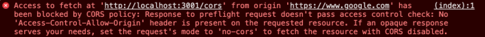
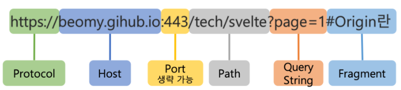
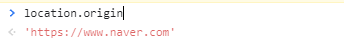
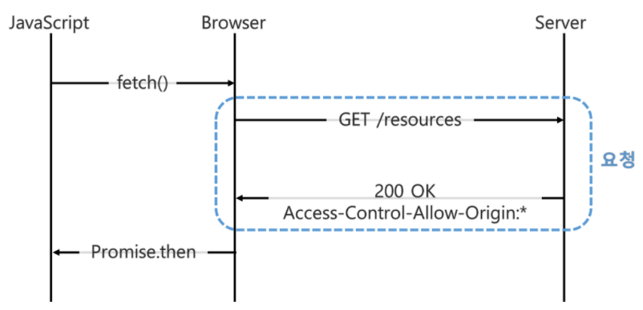
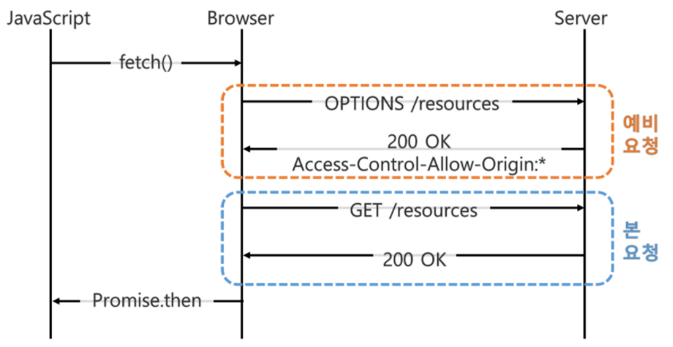

# 🤔 CORS



프론트앤드 개발을 하다보면 CORS 에러 메세지를 맞닥뜨리게 된다.

어떤 이유에서 발생하는 것인지, 어떻게 해결해야하는 것인지 확실히 짚고 넘어가면 좋을 것 같다.


## 🧐 CORS란?

### 📕 정의

> CORS(Cross-Origin Resource Sharing)

위의 에러는 CORS 정책을 위반할 때 발생하게 된다.

CORS는 Cross-Origin Resource Sharing의 약자로,

브라우저에서 다른 출처의 리소스를 공유하는 방법을 말한다.

CORS 체제는 브라우저와 서버 간의 안전한 교차 출처 요청 및 데이터 전송을 지원한다.


### 📗 출처(Origin)란??

#### ✨ URL의 구조

위의 `출처`라는 말이 무엇인지 논하기 전에 먼저 URL의 구조를 살펴보자.




#### ✨ 출처(Origin)

출처란 URL 구조에서 Protocal, Host, Port를 합친 것을 말한다.

브라우저 개발 도구의 콘솔 창에 location.origin을 치면 출처를 확인할 수 있다.




##### ◾ 같은 출처, 다른 출처

앞서 말한바와 같이 출처는 URL에서 Protocol + Host + Port이다.

고로, 같은 출처는 이 세개가 같은 것을 말하며, 다른 것은 이 세개가 다른 것을 말한다.

예를들어

`https://www.naver.com`이 있을 때

`https://www.naver.com/about`: 같은 출처

`https://www.naver.com/about?q=work`: 같은 출처

`http://www.naver.com`: 다른 출처 (Protocal 다름)

`https://www.naver.com:89/about`: 다른 출처 (Port 다름)

`https://www.never.com`: 다른 출처(Host 다름)

이런 식으로 출처의 동일 여부가 결정된다.


## 🧐 동일 출처 정책(Same-Origin Policy)

Postman 등 으로 API를 테스트하거나, 다른 서버에서 API를 호출할 때는 잘 동작하다가

브라우저에서 API를 호출할 때 `CORS`오류가 발생하곤 한다.

바로 브라우저가 `동일 출처 정책(Same-Origin Policy)`를 지켜서 다른 출처의 리소스 접근을 금지하기 때문이다.

쉽게 말해서, `www.naver.com`이라는 도메인 주소를 사용하는 웹페이지에서 `www.yeshi.com`이라는 API서버로 데이터를 요청해서 화면을 그린다면 이 웹페이지는 동일 출처 정책을 위반한 것이 된다.

##### 왜 동일 출처 정책이 있는가?

그건 바로 XSS와 같은 보안 취약점을 노린 공격을 방어할 수 있기 때문이다.

하지만, 현실적으로 외부 리소스를 많이 참고해야하는 현대에는 굉장히 걸림돌이 되는 것이 사실이다.

그래서, 외부 리소스를 사용하기 위한 SOP의 예외 조항이 **`CORS`**이다.


## 🧐 CORS 작동 원리

CORS의 동작 방식은 단순 요청 방법과 예비 요청을 먼저 보내는 방법 2가지가 있다.

다른 방법을 살펴보기 전에 CORS의 기본적인 동작흐름은 아래와 같다.

1. 기본적으로 웹은 다른 출처의 리소스를 요청할 때 HTTP 프로토콜을 사용하여 요청을 한다.
   이때, 브라우저는 요청 헤더에 `Origin`필드에 요청을 보내는 출처를 담아 전송한다.
2. 서버는 요청에 대한 응답을 하는데, 응답 헤더에 `Access-Control-Allow-Origin`이라는 값에 "해당 리소스를 접근하는 것이 허용된 출처"를 내려준다.
   이후 응답을 받은 브라우저는 자신이 보냈던 요청의 Origin과 서버가 보내준 응답의 Access-Control-Allow-Origin을 비교해 본 후 이 응답이 유효한 응답인지 아닌지를 결정한다.

하지만 이건 기본적인 흐름이고 모든 CORS 동작이 이와 같은 것은 아니다.


### 📙 Simple request

단순 요청 방법은 서버에게 바로 요청을 보내는 방법이다.

아래 그림은 자바스크립트에서 API를 요청할 때 브라우저와 서버의 동작을 나타내는 그림이다.



서버에 API 요청을 하고, 서버는 Access-Control-Allow-Origin 헤더를 포함한 응답을 브라우저에게 보낸다.

브라우저는 Access-Control-Allow-Origin 헤더를 확인해서 CORS 동작을 수행할 지 판단한다.

단, 서버로 전달하는 request는 몇가지 조건이 필요하다.

- 요청 메서드는 GET, HEAD, POST 중 하나여야 한다.
- Accept, Accept-Language, Content-Language, Content-Type, DPR, Downlink, Save-Data, Viewport-Width, Width를 제외한 헤더를 사용하면 안된다.
- Content-Type 헤더는 application/x-www-form-urlencoded, multipart/form-data, text/plain 중 하나를 사용해야한다.

이렇게 해야지만 서버로 전달하는 요청이 단순 요청으로 동작한다.

2번 조건은 사용자 인증에 사용되는 토큰을 담아보낼 Authorization 헤더도 포함되지 않아서 충족하기 까다로우며

3번 조건 또한 많은 REST API들이 Content-Type으로 application/json을 사용하기 때문에 충족하기 굉장히 어렵다.


### 📕 Preflight request

Preflight request는 서버에 예비 요청을 보내서 안전한지 판단한 후 요청을 보내는 방법이다.



Preflight 요청은 실제 리소스를 요청하기 전에 `OPTIONS`라는 메서드를 통해 실제 요청을 전송할지 판단을 한다.

`OPTIONS` 메서드로 서버에 예비 요청을 보내고, 서버는 이 예비 요청에 대한 응답으로 `Access-Control-Allow-Origin` 헤더를 포함한 응답을 브라우저에 보낸다.
(Access-Control-Allow-Origin에는 허용된 출처의 정보가 담겨져 있다.)

브라우저는 단순 요청과 동일하게 `Access-Control-Allow-Origin`헤더를 확인해서 CORS 동작을 수행할지 판단하게 된다.


## 🧐 CORS 에러 해결 방법

CORS 동작 원리를 보면, 서버에서 Access-Control-Allow-Origin 헤더를 포함한 응답을 브라우저에 보내줘야한 CORS 에러를 해결할 수 있다.

즉, 프론트 개발자는 서버에 Access-Control-Allow-Origin 등 CORS 이슈를 해결하기 위한 몇 가지 응답 헤더를 포함해 달라고 요청해야한다.

내가 배웠던 Django를 기준으로 해결하는 방법은 간단했다.

settings.py에 아래의 코드만 잘 작성해주면 해결되었다.

```python
# 1. 특정 Origin만 선택적으로 허용
CORS_ALLOWED_ORIGINS = [
    "https://example.com",
    "https://sub.example.com",
    "http://localhost:8080",
    "http://127.0.0.1:9000"
]

# 2. 모든 Origin 허용
CORS_ALLOW_ALL_ORIGINS = True
```

각 상황에 맞추어서 해주면 될 것 같다.


### 📕 Proxy

Proxy란 유저가 인터넷에 요청을 보낼 때 직접 보내는 것이 아니라 Proxy 서버를 거쳐 최종 목적지까지 전달하게 하는 것이다.

이때 Proxy 서버를 거치면서 유저의 IP를 바꿀 수 있다.

즉, 유저의 실제 IP와 포트를 알 수 없도록 하는 것이 프록시 서버의 역할이다.

이 Proxy 서버를 통해서도 CORS를 해결할 수 있는데,

예를 들어서 local에서 작업을 하고 있다면 클라이언트와 서버의 포트가 다를 것이다.

`localhost:8080` : 클라이언트

`localhost:8081` : 서버

이런 식이라면 프록시 서버를 통해서 클라이언트에서 요청을 보낼 때 

프록시 서버를 통해 주소를 `localhost:8081`로 바꿔서 보내주면 된다.