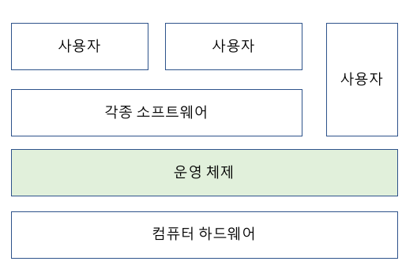
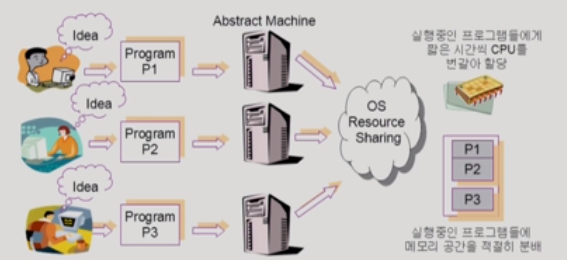
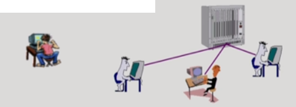
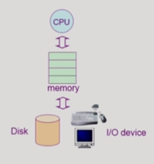

# 🤔 운영체제(OS)

## 🧐 OS

> 일종의 소프트 웨어
> 컴퓨터 시스템 자원(HW)를 효율적으로 관리하여 사용자들에게 서비스를 제공

### 1. 운영체제란 무엇인가?

✨ **컴퓨터 하드웨어 바로 위에 설치되어 사용자 및 다른 모든 소프트웨어와 하드웨어를 연결하는 소프트웨어 계층**

✨ **협의의 운영체제(커널)**

- 운영체제의 핵심 부분으로 메모리에 상주하는 부분

✨ **광의의 운영체제**

- 커널 뿐 아니라 각종 주변 시스템 유틸리티를 포함한 개념(여러가지 주변 시스템)
  - 커널 외에, 파일을 복사하는 프로그램  등등
  - 메모리에 상주하지 않는 별도의 프로그램들

### 2. 운영체제의 목적

✨ **컴퓨터 시스템을 편리하게 사용할 수 있는 환경을 제공**

- 운영체제는 동시 사용자/프로그램들이 각각 독자적 컴퓨터에서 수행되는 것 같은 환상을 제공
- 하드웨어를 직접 다루는 복잡한 부분을 운영체제가 대행

✨ **컴퓨터 시스템의 자원을 `효율적`으로 관리**

- 프로세서(CPU), 기억장치(Memory), 입출력 장치 등 리소스를 효율적 관리
  - 사용자간의 형평성 있는 자원 분배
  - 주어진 자원으로 최대한의 성능을 내도록
- 사용자 및 운영체제 자신의 보호
- 프로세스, 파일, 메시지 등을 관리

### 3. 운영 체제의 분류

#### 📕 동시 작업 가능 여부

##### ◾ 단일 작업(single tasking)

한 번에 하나의 작업만 처리

(아무래도 단일 작업만 처리하다 보니 프로그램 설계하는 데에 있어서는 훨씬 쉬움)

ex) MS-DOS프롬프트 상에서는 한 명령의 수행을 끝내기 전에 다른 명령을 수행시킬 수 없음

##### ◾ 다중 작업(multi tasking)

동시에 두개 이상의 작업 처리

ex) UNIX, MS Window 등에서는 한 명령의 수행이 끝나기 전에 다른 명령이나 프로그램을 수행할 수 있음

#### 📕 사용자의 수

##### ◾ 단일 사용자(single user)

ex) MS-DOS, MS Windows

##### ◾ 다중 사용자(multi user)

ex) UNIX, NT Server

#### 📕 처리 방식

##### ◾ 일괄 처리(batch processing)

작업 요청의 일정량 모아서 한꺼번에 처리

작업이 완전 종료될 때까지 기다려야함

##### ◾ 시분할 방식(time sharing)

여러 작업을 수행할 때 컴퓨터 처리 능력을 일정한 시간 단위로 분할하여 사용

일괄 처리 시스템(batch processing)에 비해 짧은 응답시간을 가짐 (ex. UNIX)

Interactive한 방식 (키보드를 눌렀을 때 굉장히 짧은 시간으로 반응하는 것, 거의 바로바로)

##### ◾ 실시간(Realtime OS)

정해진 시간 안에 어떠한 일이 반드시 종료됨이 보장되어야 하는 실시간 시스템을 위한 OS

특수한 목적을 가진 시스템에서 그 작업이 반드시 정해진 시간 안에 처리되도록 하는 것

ex) 원자로/공장 제어, 미사일 제어, 반도체 장비

### 4. 운영체제의 예

#### 📕 UNIX

◾ **코드의 대부분을 C언어로 작성**

◾ **높은 이식성**
다른 컴퓨터에 이식하기가 용이

◾ **최소한의 커널 구조**
핵심 기능만 커널에 넣는 것으로 메모리 가용량, 확장성 증가

◾ **복잡한 시스템에 맞게 확장 용이**

◾ **소스 코드 공개**

◾ **프로그램 개발에 용이**

◾ **다양한 버전 : System V, FreeBSD, Solaris, Linux 등**

#### 📕 DOS

##### ◾ MS사에서 1981년 IBM-PC를 위해 개발

##### ◾ 단일 사용자용 운영체제, 메모리 관리 능력의 한계(주 기억 장치: 640kb)

#### 📕 MS Windows

##### ◾ MS사의 다중 작업용 GUI 기반 운영 체제

##### ◾ Plug and Play, 네트워크 환경 강화

##### ◾ DOS용 응용 프로그램과 호환성 제공

##### ◾ 풍부한 자원 소프트웨어

#### 5. 운영체제의 구조

##### ✨ CPU: 누구한테 CPU를 줄지(CPU 스케줄링)

##### ✨ Memory: 한정된 메모리를 어떻게 쪼개어 쓸지(메모리 관리)

##### ✨ Disk: 디스크에 파일을 어떻게 보관할지(파일 관리, 디스크 스케쥴링)

##### ✨ I/O device: 각기 다른 입출력장치와 컴퓨터 간에 어떻게 정보를 주고 받을지(입출력 관리)

##### ✨ 프로세스 관리: 프로세스의 생성과 삭제, 자원 할당 및 반환, 프로세스 간 협력