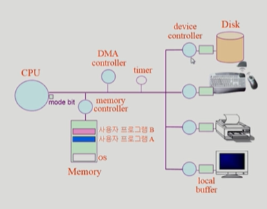

# 🤔 System Structure & Program Execution

## 🧐 컴퓨터 시스템 구조

>  **메인 처리를 담당하는 CPU와 Memory 그리고 각각의 Input/Output Device들로 구성된다.그리고 각각의 디바이스를 통제하는 각각의 device controller와 local buffer가 존재한다.**

### 📕 CPU

✨ **CPU는 매 클럭 싸이클마다 Memory에서 기계어(instruction)를 하나씩 읽어들여 처리한다.(Instruction이 끝나면 interrupt line을 검사한다.)**

✨ **CPU 안에는 mode bit, register, Interrupt line가 존재한다.**

 - register: 메모리보다 더 빠르게 정보를 저장하는 작은 공간
   	- 다음 작업할 instruction의 주소값을 저장해 놓는다.
 - mode bit: 지금 CPU를 사용하고 있는 주체가 OS인지 사용자 프로그램인지를 구분해준다.
    - 사용자 프로그램의 잘못된 수행으로 다른 프로그램 및 운영체제에 피해가 가지 않도록 하기 위한 보호 장치 필요
    - mode bit이 1 => 사용자 모드(사용자 프로그램 수행)
    - mode bit이 0 => 모니터 모드(OS코드 수행)
    - 사용자 프로그램은 나쁜 짓을 할 수 있기 때문에 mode bit을 활용해 보호를 해준다.
      (ex. 사용자 프로그램에서 명령어를 끼워 뭔가 악성 코드를 실행시킬 수 있는데, 이때 mode bit이 0이기 때문에 중요한 명령어 수행을 하지 않는다.(중요 명령어 수행은 모니터 모드에서만!))
	- interrupt line: 입출력 관련 interrupt가 발생한 경우, 발생한 interrupt를 확인한다.

✨ **I/O device에 직접 접근하는 것은 Memory이고 CPU는 Memory의 Instruction만 계속 받아서 처리만 하는 역할을 담당한다.**

✨ **CPU에서 입출력장치(I/O device)에 접근해야할 일이 생기면, 직접 접근하지 않고 controller에게 작업 명령을 내린다. 그리고 나서 다음 메모리 접근을 하여 다음 task를 수행한다.**

### 📕 Memory

✨ **CPU의 작업 공간**

### 📕 I/O device

✨ **정보를 입력받고, 내보내는 입출력 장치**

✨ **장치제어기(device controller)**

- 각 입출력 장치를 전담하는 **작은 CPU**이다. 각 장치의 어떤 부분에서 어떤 내용을 읽어올지를 담당한다.
  (입출력 장치는 CPU에 비해 속도가 현저히 느리기 때문에 장치 제어기가 필요하다.)
- device driver(장치 구동기): OS 코드 중 각 장치별 처리 루틴 => SW
- device controller(장치 제어기): 각 장치를 통제하는 일종의 작은 CPU => HW

✨ **local buffer**

- 장치 제어기의 작업 공간이다. 데이터가 담겨지는 공간!! (CPU의 Memory와 같은 관계)

✨ **키보드에 입력된 데이터가 local buffer에 들어오면 controller가 CPU에 Interrupt를 건다. 그러면 CPU 제어권이 운영체제로 넘어가게 되는데, 그러면 운영체제가 Interrupt가 왜 들어왔는지 확인 한 뒤 입력을 요청한 프로그램에 입력된 값을 메모리 공간에 copy를 해주고 CPU에서 실행되던 프로그램의 할당 시간이 끝난 뒤에 CPU를 입력값 받은 프로그램에 할당해준다.**

#### ✨ 입출력(I/O)의 수행

- 모든 입출력 명령은 특권 명령이다.
  -  즉, 사용자 프로그램이 직접 입출력 장치에 접근하지 못하고 OS를 통해서 접근해야한다.
- 사용자 프로그램은 어떻게 I/O 하는가?
  - **시스템콜(system call)** : 사용자 프로그램은 운영체제에게 I/O를 요청한다.
    (사용자 프로그램이 운영체제의 서비스를 받기 위해 커널 함수를 호출하는 것)
  - 간략하게, 인터럽트를 걸어서 mode bit을 0으로 바꾼 뒤 OS에 CPU할당하고 I/O 작업을 수행한다.
  - 1. Trap을 사용하여 인터럽트 벡터의 특정 위치로 이동한다.
    2. 제어권이 인터럽트 벡터가 가리키는 인터럽트 서비스 루틴으로 이동한다.
    3. 옳바른 I/O요청인지 확인 후 수행한다.
    4. I/O 완료 시 제어권을 시스템콜 다음 명령으로 옮긴다.

> **인터럽트(Interrupt)?**
>
> - 인터럽트 당한 시점의 레지스터와 program counter를 save한 후 CPU의 제어를 인터럽트 처리 루틴에 넘긴다.
> - 넓은 의미
>   - Interrupt(HW Interrupt): 하드웨어가 발생시킨 인터럽트(보통 이 의미로 쓰인다.)
>   - Trap(SW Interrupt)
>     - Exception: 프로그램이 오류를 범한 경우
>     - System call: 프로그램이 커널 함수를 호출하는 경우
>   - I/O를 요청할 땐 SW Interrupt를 통해 mode bit을 1로 한 뒤 OS로 I/O 장치에 접근한다.
>   - I/O가 끝났을 때는 HW Interrupt를 통해 끝남을 알려준다.
> - 관련 용어
>   - 인터럽트 벡터 : 해당 인터럽트의 처리 루틴 주소를 가지고 있다.
>   - 인트럽트 처리 루틴 : 해당 인터럽트를 처리하는 커널 함수

### 📕 Timer

✨ **정해진 시간이 흐른 뒤 운영체제에게 제어권이 넘어가도록 인터럽트를 발생시킨다.**

✨ **타이머는 매 클럭 틱 때마다 1씩 감소한다.**

✨ **타이머 값이 0이 되면 타이머 인터럽트가 발생한다.**

✨ **CPU를 특정 프로그램이 독점하는 것으로 부터 보호한다.**

- 예를 들어 만일 CPU자원을 낭비하는 무한 루프 프로그램이 있다면 CPU는 다음 업무를 하지 않고 그 프로그램만 실행할 것이다. 이를 막기 위해 `Timer`라는 하드웨어가 존재하는데, 이는 특정 프로그램이 CPU를 독점하는 것을 방지한다. 프로그램에 CPU를 할당할 때 Timer에 특정한 값을 설정하고 진행한다. 

✨ **타이머는 time sharing을 구현하기 위해 널리 이용된다.**

✨ **타이머는 현재 시간을 계산하기 위해서도 사용된다.**

### 📕 DMA controller

✨ **I/O 장치가 자주 인터럽트를 걸 때 이를 중간에서 DMA가 local buffer에 있는 데이터를 Memory에 copy하는 작업을 수행한다.**

✨ **CPU가 일일이 해주어야 했던 copy작업을 대신 해줌으로써 더욱 CPU의 효율이 올라간다.**

✨ **최종적으로 CPU에 인터럽트를 걸어서 모든 copy작업을 마쳤다는 보고를 하며 한방에 처리!**

