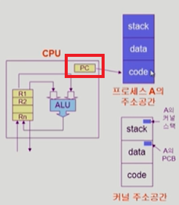
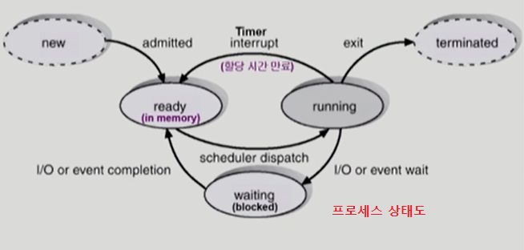
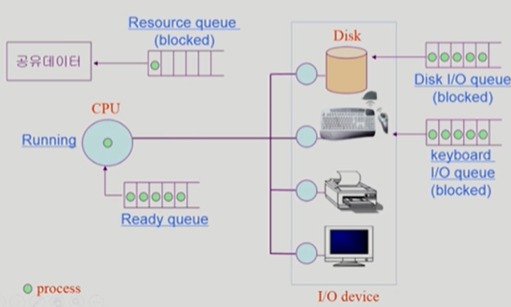
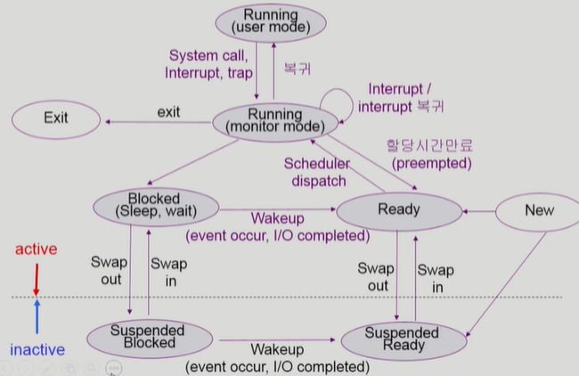
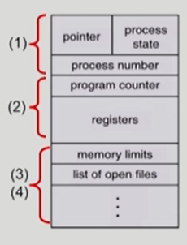
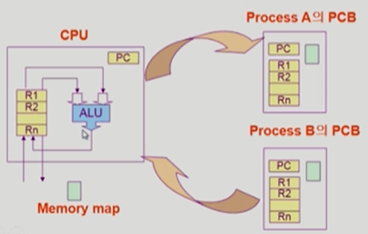
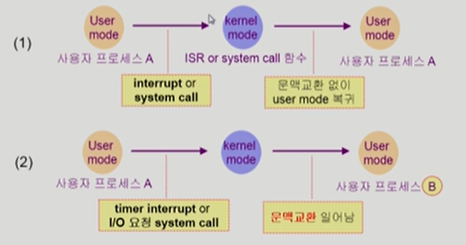
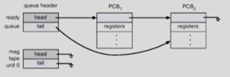

# 🤔 프로세스

> Process is  a program in execution

## 🧐 프로세스

### 📕 개념

##### ✨ 프로세스는 실행 중인 프로그램이다.

✨ 프로세스의 문맥(context) 

- **특정 시점을 놓고 봤을 때 프로세스가 어떻게 어디까지 수행했는지 규명하는데 필요한 요소**

- CPU 수행 상태를 나타내는 하드웨어 문맥
  - Program Counter
  - 각종 register

- 프로세스의 주소공간 (현재 시점의 주소공간)
  - code, data, stack
- 프로세스 관련 커널 자료구조
  - PCB(Process Control Block)
  - Kernel stack (각각의 프로세스별로 하나의 스택을 별도로 두어 정보의 꼬임을 방지한다.)

✨ **PC(Program Counter)** 

- 프로그램 카운터 레지스터, 계속 code를 바라보며 instruction을 읽어들인다.
- 읽어들여와서 레지스터에 저장하고 ALU(산술연산장치)로 계속 연산을 수행한다.

### 📗 프로세스의 상태

##### ✨ 프로세스는 상태(state)가 변경되며 수행된다.

- **Running** : CPU를 잡고 instruction을 수행중인 상태
- **Ready** : CPU를 기다리는 상태(메모리 등 다른 조건을 모두 만족하고)
- **Blocked(wait, sleep)** : CPU를 주어도 당장 instruction을 수행할 수 없는 상태
  - Process 자신이 요청한 event(ex. I/O작업)가 즉시 만족되지 않아 이를 기다리는 상태이다.(ex. 디스크에서 file 읽어오기)
- **Suspended(stopped)**
  - 메모리를 완전히 잃어버려 swap out된 상태
  - 외부적인 이유로 프로세스의 수행이 정지된 상태
  - 프로세스는 통째로 디스크에 swap out된다.
  - ex. 사용자가 프로그램을 일시 정지시킨 경우(break key) 시스템이 여러 이유로 프로세스를 잠시 중단시킨다.(메모리에 너무 많은 프로세스가 올라와 있을 경우)
- New : 프로세스가 생성중인 상태
- Terminated : 수행이 끝난 상태
- Blocked는 자신이 요청한 event가 만족되면 Ready상태로 되돌아 가는 반면,
  Suspended는 외부에서 정지시킨 것이기 때문에 외부에서 resume해 주어야 Active상태가 된다.

> 과정을 간단히 살펴보면
>
> 1. Running 중에 있다가 I/O 입력이 필요해진다.
> 2. Keyboard의 I/O queue에 줄을 서고 입력을 받는다.
> 3. 그러면 CPU에 인터럽트를 걸고
> 4. Ready queue에서 차례를 기다린다.

※ Suspended가 추가된 프로세스 상태도

### 📘 PCB

##### ✨ 운영체제가 각 프로세스를 관리하기 위해 프로세스당 유지하는 정보

✨ 다음의 구성 요소를 가진다. (구조체로 유지)

- (1) OS가 관리상 사용하는 정보
  - Process state, Process ID
  - scheduling information, priority
- (2) CPU 수행 관련 하드웨어 값
  - Program counter, registers
- (3) 메모리 관련
  - Code, data, stack의 위치 정보
- (4) 파일 관련
  - Open file descriptors..

### 📕 문맥 교환(Context Switch)

##### ✨ CPU를 한 프로세스에서 다른 프로세스로 넘겨주는 과정

##### ✨ CPU가 다른 프로세스에게 넘어갈 때 운영체제는 다음을 수행한다.

- CPU를 내어주는 프로세스의 상태를 그 프로세스의 PCB에 저장한다.
- CPU를 새롭게 얻는 프로세스의 상태를 PCB에서 읽어온다.

✨ **A를 실행하다가 CPU를 넘겨줄 때, 현재까지의 진행 상태를 Process A의 PCB에 저장해둔다.**
       (다음 실행 때 거기서 부터 할 수 있도록!)
       (이때 저장하는 곳은 커널 주소공간 data에 저장한다.)

##### ✨ 단, System call 이나 Interrupt 발생 시 반드시 context switch가 일어나는 것은 아니다. 

#####      (context switch는 하나의 사용자 프로세스에서 다른 사용자 프로세스로 넘어가는 것이다.)

> (1)의 경우에도 Program Counter가 사용자 프로그램의 코드를 보다가 System call로 인해서 커널 코드를 보게 되는데, 이때 CPU 수행 정보 등 context의 일부를 PCB에 저장해야 한다. 
> **하지만** 문맥교환을 하는 (2)의 경우 그 부담이 훨씬 크다.

### 📗 프로세스를 스케줄링 하기 위한 큐

> 각각의 프로세스들은 각 큐들을 오가며 수행된다.

##### ✨ Job queue

- 현재 시스템 내에 있는 모든 프로세스의 집합

##### ✨ Ready queue

- 현재 메모리 내에 있으면서 CPU를 잡아서 실행되기를 기다리는 프로세스의 집합

- PCB의 구조를 보면 pointer가 있는데 각각의 pointer를 가리키는 형태로 큐에 줄을 선다.

##### ✨ Device queue

- I/O device의 처리를 기다리는 프로세스의 집합

### 📘 스케줄러(Scheduler)

> 각각의 자원별로 어떻게 할당할지

##### ✨ Long-term scheduler(장기 스케줄러 or job scheduler)

- 시작 프로세스 중 어떤 것들을 ready queue로 보낼지 결정
- 프로세스에 memory(및 각종 자원)을 주는 문제
- degree of Multiprogramming을 제어 (메모리에 프로그램이 다수 올라가는 것을 제어)
- time sharing system에는 보통 장기 스케줄러가 없다. (무조건 ready)

##### ✨ Short-term scheduler(단기 스케줄러 or CPU scheduler)

- 어떤 프로세스를 다음번에 **running** 시킬지 결정
- 프로세스에 CPU를 주는 문제
- 충분히 빨라야한다.(millisecond 단위)

##### ✨ Medium-Term Scheduler(중기 스케줄러 or Swapper)

- 여유 공간 마련을 위해 프로세스를 통째로 메모리에서 디스크로 쫓아낸다.
- 프로세스에게서 memory를 뺏는 문제
- degree of Multiprogramming을 제어
- (보통 장기 스케줄러 없이 memory에 다 올려놓고 중기 스케줄러로 관리)
- 중기 스케줄러로 인해 프로세스의 상태에 Suspended가 있는 것이다.