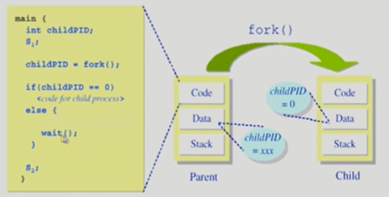
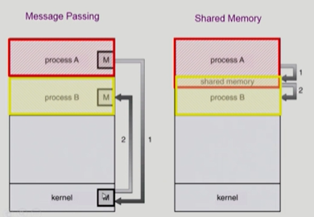

# 🤔 Process Management


## 🧐 Process Management


### 1. 프로세스의 생성(Process Creation)

##### ✨ 부모 프로세스가 자식 프로세스 생성 (보통 복제 생성)

##### ✨프로세스의 트리(계층 구조) 형성 (하나의 부모가 여러 자식을, 또 하나의 자식들이 여러 자식들을 ... 계층구조)

##### ✨ 프로세스는 자원을 필요로 한다.

- 운영체제로부터 받는다.
- 부모와 공유한다

##### ✨ 자원의 공유

- 부모와 자식이 모든 자원을 공유하는 모델
- 일부를 공유하는 모델
- 전혀 공유하지 않는 모델 (일반적)

##### ✨ 수행(Execution)

- 부모와 자식은 공존하며 수행되는 모델
- 자식이 종료(terminate)될 때까지 부모가 기다리는(wait) 모델

##### ✨ 주소 공간(Address space)

- 자식은 부모의 공간을 복사한다. (PCB라던지 OS data 자원들)
- 자식은 그 공간에 새로운 프로그램을 올린다.

##### ✨ 프로세스와 관련한 시스템 콜

**fork()**

- 프로세스는 fork()라는 시스템콜 함수에 의해서 생성된다.

- ```c
  int main() 
  {
      ...
      pid = fork(); //프로세스 하나 생성
      ...
  }
  ```

- fork() 함수의 return 값을 다르게 하여 (ex. 부모는 1, 자식은 0) 각각의 프로세스에 각각의 수행 로직을 작성할 수 있다.

**exec()**

- exec() 시스템 콜은 프로세스가 다른 프로그램을 실행시킬 수 있도록 해준다.

- exec()는 어떤 프로그램을 완전히 새로운 프로세스로 태어나게 해준다.

  ```c
  int main()
  {
      ...
      pid = fork()
      if (pid == 0)
      { 
          execlp("/bin/date", "/bin/date", (char*)0); //exec 이후의 코드는 실행 x
      }
      ....
  }
  ```

**wait()**

- 프로세스 A가 wait() 시스템 콜을 호출하면
- 커널은 child(자식 프로세스)가 종료될 때까지 프로세스 A를 sleep 시킨다. (block 상태)
- Child process가 종료되면 커널은 프로세스 A를 깨운다. (ready 상태)



**exit()**

- 프로세스의 종료
  - 자발적 종료
    - 마지막 statement 수행 후 exit() 시스템 콜을 통해 프로그램에 명시적으로 적어주지 않아도 main 함수가 리턴되는 위치에 컴파일러가 넣어준다.
  - 비자발적 종료
    - 부모 프로세스가 자식 프로세스를 강제 종료시킨다.
      - 자식 프로세스가 한계치를 넘어서는 자원 요청
      - 자식에게 할당된 테스크가 더 이상 필요하지 않은 경우
    - 키보드로 kill, break 등을 친 경우
    - 부모가 종료하는 경우
      - 부모 프로세스가 종료하기 전에 자식들이 먼저 종료된다.


### 2. 프로세스 종료(Process Termination)

##### ✨ 프로세스가 마지막 명령을 수행한 후 운영체제에게 이를 알려줌(exit)

- 자식이 부모에게 output data를 보낸다.(via wait)
- 프로세스의 각종 자원들이 운영체제에게 반납된다.

##### ✨ 부모 프로세스가 자식의 수행을 종료시킨다.(abort) (강제적으로 종료)

- 자식이 할당 자원의 한계치를 넘어설 때
- 자식에게 할당된 테스크가 더 이상 필요하지 않을 때
- 부모가 종료(exit)하는 경우
  - 운영체제는 부모 프로세스가 종료하는 경우 자식이 더 이상 수행되도록 두지 않는다.
  - 단계적인 종료


### 3. 프로세스 간 협력

##### ✨ 독립적 프로세스

- 프로세스는 각자의 주소 공간을 가지고 수행되므로 원칙적으로 하나의 프로세스는 다른 프로세스의 수행에 영향을 미치지 못한다.


##### ✨ 협력 프로세스

- 프로세스 협력 메커니즘을 통해 하나의 프로세스가 다른 프로세스의 수행에 영향을 미칠 수 있다.


##### ✨ 프로세스 간 협력 메커니즘(IPC, Interprocess Communication)



- 메시지를 전달하는 방법

  - message passing: 커널을 통해 메시지 전달

  - > Message Passing
    >
    > - Message system : 프로세스 사이에 공유변수를 일체 사용하지 않고 통신하는 시스템
    > - Direct Communication: 통신하려는 프로세스의 이름을 평시적으로 표시
    > - Indirect Communication: mailbox(또는 port)를 통해 메시지를 간접 전달

- 주소 공간을 공유하는 방법

  - shared memory: 서로 다른 프로세스 간에도 일부 주소 공간을 공유하게 하는 shared memory 메커니즘이 있다.
  - **thread**: thread는 사실상 하나의 프로세스이므로 프로세스 간 협력으로 보기는 어렵지만 동일한 process를 구성하는 thread간에는 주소 공간을 공유하므로 협력이 가능하다.