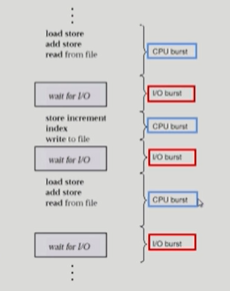
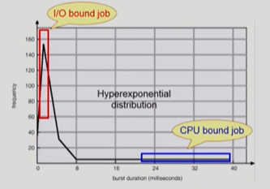
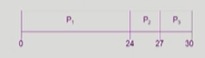
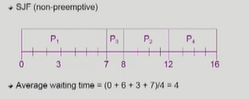
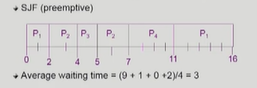
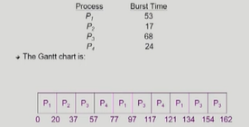
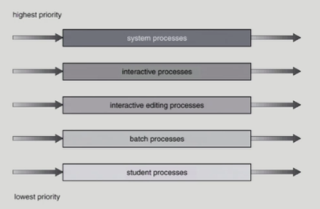
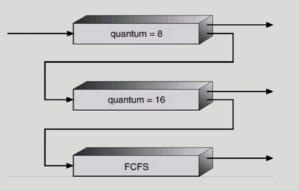
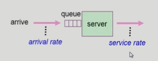

# 🤔 CPU 스케줄링

## CPU Scheduling

### 📕 CPU and I/O Bursts

프로그램을 실행시키면 기본적으로 CPU burst와 I/O burst가 번갈아 가며 일어난다.

CPU가 뭔가 작업을 하고 I/O 작업을 통해 사용자의 입력값을 받고 이러한 절차로 프로그램이 실행되는 것이다.

하지만 시스템의 종류에 따라서는 이 절차의 빈도 및 길이가 다를 수가 있다.

##### ✨ CPU-burst Time의 분포

> ##### 프로세스의 특성 분류
>
> I/O bound job : CPU룰 잡고 계산하는 시간보다 I/O에 많은 시간이 필요한 job (many short CPU bursts)
>
> CPU bound job : CPU만 아주 오랫동안 사용하는 job, 계산 위주의 job (few  very long CPU bursts)

- CPU burst가 짧다는 것은 중간에 I/O작업이 많이 끼어들었다는 것이고 반대는 반대를 뜻한다.

- 여러 종류의 job(=process)이 섞여 있기 때문에 **CPU 스케줄링**이 필요하다.
- Interactive job에게 적절한 response 제공 요망
- CPU와 I/O 장치 등 시스템 자원을 골고루 효율적으로 사용
- CPU 스케줄링 할 때 공평한것도 좋지만 사용자와 자주 인터렉티브 하는 I/O bound job 같은 것에 우선적으로 CPU를 할당하는 것이 필요하다.

### 📘 CPU Scheduler & Dispatcher

##### ✨ CPU Scheduler

> 운영체제 안에서 스케줄링 해주는 특정 코드

- Ready 상태의 프로세스 중에서 이번에 CPU를 줄 프로세스를 고른다.
- CPU 스케줄링이 필요한 경우는 프로세스에게 다음과 같은 상태 변화가 있는 경우다.
  - 1. Running => Blocked (ex. I/O 요청하는 시스템 콜)
  - 2. Running => Ready (ex. 할당시간만료로 timer interrupt)
  - 3. Blocked => Ready (ex. I/O 완료 후 인터럽트)
  - 4. Terminate
  - (1, 4)에서의 스케줄링은 nonpreemptive(=강제로 빼앗지 않고 자진 반납, 비선점형)
  - 다른 것들은 preemptive(=강제로 빼앗음)
    - I/O 작업이 끝난 뒤 인터럽트가 왔을 때 cpu를 사용하고 있는 프로세스가 있을 텐데, 이때 우선순위 스케줄링인 경우 강제로 빼앗아서 I/O작업이 끝난 프로세스에게 넘겨주는 것이 필요하다.
    - 대부분 preemptive 사용

##### ✨ Dispatcher

- CPU의 제어권을 CPU scheduler에 의해 선택된 프로세스에게 넘긴다.
- 이 과정을 context switch(문맥 교환)라고 한다.

### 📙 Scheduling Algorithms

##### ✨ FCFS(First-Come First-Served)

- 먼저 온 순서대로 처리

- 비선점형 스케줄링(cpu를 얻으면 자신이 내어놓을때까진 빼앗기지 않는)

- 썩 효율적이진 않다.

- 

- > Waiting time for P1 = 0, P2 = 24, P3 = 27
  >
  > Average waiting time = (0 + 24 + 27)/ 3 = 17
  >
  > 짧은 것들을 먼저 수행하면 더 효율적일 수 있는데 FCFS에서는 이렇게 비효율성이 보인다.
  > (*Convoy effect: 긴 프로세스 뒤에 감춰진 짧은 프로세스)

##### ✨ SJF(Shortest-Job-First)

- 각 프로세스와 다음번 CPU burst time을 가지고 스케줄링에 활용

- CPU burst time이 가장 짧은 프로세스를 제일 먼저 스케줄

- Two schemes

  - Nonpreemptive
    - 일단 CPU를 잡으면 이번 CPU burst가 완료될 때까지 CPU를 선점(preemption)당하지 않음
  - Preemptive
    - 현재 수행중인 프로세스의 남은 burst time보다 더 짧은 CPU burst time을 가지는 새로운 프로세스가 돡하면 CPU를 빼앗김
    - 이 방법은 Shortest-Remaining-Time-First(SRTF)이라고도 부른다.

- 주어진 프로세스에 대해 minimun average waiting time 보장

- 평균 대기 시간을 현저히 줄일 수 있다.

- 

  > non-preemptive
  >
  > CPU를 다 쓰고 나가는 시점에 스케줄링을 할지 안할지 결정을 한다.

- 

  > preemptive
  >
  > 선점형이기 때문에 P1이 CPU를 처음에 얻었지만 짧은 프로세스가 들어오면 CPU를 빼앗긴다.
  >
  > 대기시간이 3초로 앞의 non-preemptive보다 더 짧다.
  >
  > 새로운 프로세스가 도착할 때마다 스케줄링을 할지 안할지 결정을 한다.

- SJF는 짧은 프로세스를 선호한다. 그래서 긴 것은 영원히 그 차례가 안올 수 있다는 단점이 존재한다.

  (+) 다음 CPU Burst Time을 예측하기 어렵다. 즉, CPU를 얼마나 쓰고 나갈지를 알 수 없다는 것이다. 왜냐하면, 미래에 짧은 것이 들어오면 CPU를 빼앗기는 로직 때문에 그렇고 미래에 들어올 프로세스는 미리 알 수없기 때문이다. 
  다만, 추정(estimate)은 가능하다. 과거의 CPU burst time 흔적을 통해서 예측한다.

##### ✨ SRTF(Shortest-Remaining-Time-First)

##### ✨ Priority Scheduling

- 우선순위 스케줄링
- highest priority를 가진 프로세스에게 CPU할당
  - Preemptive : 우선순위가 더 높은 프로세스가 들어왔을 때 cpu 뺏기 가능
  - nonpreemptive : 더 높은 우선순위가 도착하더라도 기다리기
- SJF는 일종의 priority scheduling이다.
- 문제점
  - Starvation(기아 현상): 낮은 우선순위 프로세스는 실행이 안될 수도 있다.
- 해결법
  - Aging: 시간이 지나면 우선순위를 올려준다.

##### ✨ RR(Round-Robin)

- 현대적인 cpu 스케줄링은 RR에 기반한다.

- 각 프로세스는 동일한 크기와 할당 시간(time quantum)을 갖는다.

- 할당 시간이 지나면 프로세스는 선점(preempted)당하고 ready queue의 제일 뒤에 가서 다시 줄을 선다.

- 가장 좋은 점은 Response time(응답시간)이 빨라진다.
  조금씩 cpu를 줬다 뺏었다 하기 때문에 최초 CPU 얻는 시간이 짧아진다.

- n개의 프로세스가 ready queue에 있고 할당 시간이 **q** time unit 인 경우 각 프로세스는 최대 **q** time unit 단위로 CPU 시간의 1/n을 얻는다.

  즉, 할당시간이 q일때 적어도 (n-1) * q 이면 자기 차례가 한번은 온다.
  => CPU를 길게 쓰는 프로세스는 기다리는 시간도 길어지고 짧은 것은 기다리는 시간도 짧아진다. 즉, 기다리는 시간이 본인의 시간에 비례한다. 

- 

- Performance

  - **q** large => FCFS
  - **q** small => context switch 오버헤드가 커진다.

- 일반적으로 SJF보다 average turnaround time이 길지만 response time은 더 짧다.

##### ✨ Multilevel Queue

> 높은 priority부터 cpu를 할당한다.
>
> 높은 우선순위의 process가 없으면 그 다음 우선순위의 process에게 할당하는 형태

- Ready queue를 여러개로 분할
  - foreground (interactive) : foreground queue에는 interactive한 job을 넣고
    (사람과 interaction하는 그런 job들)
  - background (batch-no human interaction) : background queue에는 batch한 job을 넣는다. 
    (interactin 없이 CPU만 오래쓰는 그런 job은 background queue에..)
- 각 큐는 독립적인 스케줄링 알고리즘을 갖는다.
  - foreground - RR (사용자와 교감하는 부분이니 RR로 응답시간을 짧게)
  - background - FCFS
- 큐에 대한 스케줄링이 필요하다
  - Fixed priority scheduling
    - 우선순위가 높은 것을 먼저 한다.
    - 기아현상이 나타날 수 있다.
  - Time slice
    - 각 큐에 CPU time을 적절한 비율로 할당
    - Ex. 80%는 우선순위가 높은 줄(foreground in RR)에 주고, 20%는 우선순위가 낮은(background in FCS) 줄에 준다.

##### ✨ Multilevel Feedback Queue

- 프로세스가 다른 큐로 이동 가능
- 에이징을 이와 같은 방식으로 구현할 수 있다.
- Multilevel-feedback-queue scheduler를 정의하는 파라미터들
  - Queue의 수
  - 각 큐의 scheduling algorithm
  - Process를 상위 큐로 보내는 기준
  - Process를 하위 큐로 내쫓는 기준
  - 프로세스가 CPU 서비스를 받으려 할 때 들어갈 큐를 결정하는 기준

##### ✨ Multiple-Processor Scheduling (cpu가 여러개인 시스템)

- CPU가 여러 개인 경우 스케줄링은 더욱 복잡해진다.
- Homogeneous processor인 경우
  - Queue에 한 줄로 세워서 각 프로세서가 알아서 꺼내가게 할 수 있다.
  - 반드시 특정 프로세서에세 수행되어야 하는 프로세스가 있는 경우에는 문제가 더 복잡해진다.
- Load sharing
  - 일부 프로세서에 job이 몰리지 않도록 부하를 적절히 공유하는 메커니즘 필요
  - 별개의 큐를 두는 방법 vs 공동 큐를 사용하는 방법
- Symmetric Multiprocessing(SMP):
  - 각 프로세서가 각자 알아서 스케줄링 결정
- Asymmetric mulitprocessing
  - 하나의 프로세서가 시스템 데이터의 접근과 공유를 책임지고 나머지 프로세서는 거기에 따름

##### ✨ Real-Time Scheduling

> 데드라인을 보장

- Hard real-time systems
  - Hard real-time task는 정해진 시간 안에 반드시 끝내도록 스케줄링해야 함
- Soft real-time computing
  - Soft real-time task는 일반 프로세스에 비해 높은 priority를 갖도록 해야함

##### ✨ Thread Scheduling

- Local Scheduling
  - User level thread의 경우 사용자 수준의 thread library에 의해 어떤 thread를 스케줄할지 결정
- Global Scheduling
  - Kernel level thread의 경우 일반 프로세스와 마찬 가지로 커널의 단기 스케줄러가 어떤 thread를 스케줄할지 결정 

### 📕 Scheduling Criteria(CPU 성능 척도)

#### 🧨 시스템 입장에서의 성능 척도

##### ✨ CPU utilization (이용료)

- CPU가 놀지 않고 일한 정도

##### ✨ Throughput(처리량)

- 주어진 시간 안에 몇개의 작업을 하는지

#### 🧨 시간 관련 성능 척도(프로세스 입장에서의 성능 척도)

##### ✨Turnaround time(소요시간, 반환시간)

- CPU를 쓰러 들어와서 다 쓰고 나갈때 까지 걸린 시간

##### ✨ Waiting time(대기시간)

- 순수하게 줄서서 기다리는 동안의 총 시간

##### ✨ Response time(응답 시간)

- 처음으로 CPU를 얻기까지 걸린 시간

### 📘 Algorithm Evaluation

##### ✨ Queueing models

- 굉장히 이론적인 방법
- 확률 분포로 주어지는 arrival rate와 service rate(처리율)등을 통해 각종 performance index값을 계산

##### ✨ Implementation(구현) & Measurement(성능 측정)

- 실제 시스템에 알고리즘을 구현하여 실제 작업(workload)에 대해서 성능을 측정 비교
- 실제 시스템에 구현하여 돌려보고 성능을 측정하는 방법

##### ✨ Simulation(모의실험)

- 알고리즘을 모의 프로그램을 작성 후 trace를 입력으로 하여 결과 비교
- 실제로 돌리는 것이 아닌 모의실험
- 시뮬레이션 프로그램을 짜서 모의적으로 실험

