# 🤔 Process Synchronization

> 프로세스 동기화
>
> Concurrency Control(병행 제어)

### 📕 데이터의 접근

Data를 담고있는 Storage 상자를 하나의 Execution 상자가 사용하면

그냥 데이터를 읽고 연산하고 연산 결과를 저장하면 된다.

하지만, 

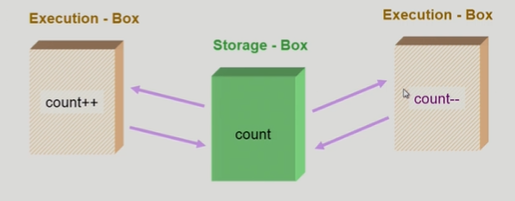

이렇게 S-box를 공유하는 E-box가 여럿 있는 경우 Race Condition의 가능성이 생긴다.

(예를 들어, S-box에 1이 저장되어있고 실행하게 되면 E-box들은 1이라는 데이터를 가져간다.
그리고 count++는 1에 더하기를 해서 2를 저장하게되는데,
count--는 1에서 뺄샘을 하여 0을 저장하게 된다.
원래는 1더해지고 1빼지고하여 기존 데이터와 동일한 1이 저장되어야하는데,,
이런 점에서 Race Condition이라는 문제점이 생기게 되는 것이다.)

*Race Condition : 여러 주체가 하나의 데이터를 동시에 접근하려고 할 때, "경쟁상태"

##### ✨ os에서 race condition은 언제 발생하는가?

- kernel 수행 중 인터럽트 발생 시

  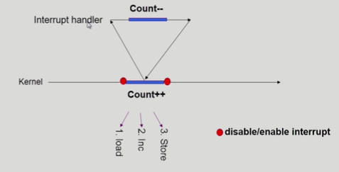

  > 인터럽트가 발생하게 되는데
  > 결과적으로는 1증가한 값을 저장해놓았다가 count--를 실행하고 증가시켜둔 저장된 값을 Store에 반영한다. 즉, Count--는 반영이 안되는 것이다.
  >
  > 이를 해결하기 위해 중요 변수에 접근할 때는 interrupt가 disable되어 끼어들지 못하게 해두고 작업이 끝나면 interrupt가 실행되게 하는 방법이 있다.
  >
  > 커널모드 running중 interrupt가 발생하여 인터럽트 처리루틴이 수행 
  > => 양쪽 다 커널 코드이므로 kernel address space 공유

- Process가 system call을 하여 kernel mode로 수행 중인데 context switch가 일어나는 경우

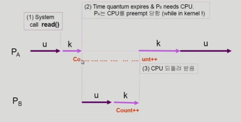

> u: user, k: kernel
>
> 시스템콜로 인해서 kernel함수를 실행중이던 와중에 context switch가 발생!
>
> 이렇게 되면 A에서 먼저 count값을 불러왔고 실행중이었기 때문에 B의 덧셈이 반영이 되지 않는다.
>
> 결국 A로 할당이 다시 되어 읽어왔던 값을 1증가시킨 다음에 저장하기 때문이다.
>
> 이를 해결하기 위해 커널 모드에서 수행 중일 때는 CPU를 preempt하지 않는다. 즉 뺏지 않는다는 것이다.
> 커널 모드에서 사용자 모드로 돌아갈 때 preempt!
> (이렇게 되면 할당에 있어서 시간 편차가 조금 생기게 된다. A가 조금 더 할당을 많이 받게 된다. 하지만, 시간을 좀 더 줬다 해서 큰 문제가 발생하진 않는다.)

- Multiprocessor에서 shared memory 내의 kernel data

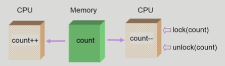

> 어떤 CPU가 마지막으로 count를 store했는가? => race condition
>
> multiprocessor의 경우 interrupt enable/disable로 해결되지 않는다.
>
> 방법1. 한번에 하나의 CPU만이 커널에 들어갈 수 있게 하는 방법
>
> 방법2. 커널 내부에 있는 각 공유 데이터에 접근할 때마다 그 데이터에 대한 lock/unlock을 하는 방법
> (맨 처음 데이터에 접근하여 수정할 때 데이터 자체에 다른 cpu가 접근 못하게 lock을 거는 방법, 그리고 수정 후엔 unlock)

## 🧐 Processor Synchronization

### 📗 Process Synchronization 문제

##### ✨ 공유 데이터(shared data)의 동시 접근은 데이터의 불일치 문제를 발생시킬 수 있다.

##### ✨ 일관성 유지를 위해서는 협력 프로세스간의 실행순서를 정해주는 메커니즘이 필요하다.

##### ✨ Race condition

- 여러 프로세스들이 동시에 공유 데이터를 접근하는 상황
- 데이터의 최종 연산 결과는 마지막에 그 데이터를 다룬 프로세스에 따라 달라진다.

##### ✨race condition을 막기 위해서는 동시접근(concurrent process)은 동기화(synchronize)되어야 한다.

### 📕 The Critical-Section Problem

> Critical-Section(임계구역) : 공유데이터에 접근하는 코드
>
> n개의 프로세스가 공유 데이터를 동시에 사용하기를 원하는 경우 각 프로세서의 code segment에는 공유 데이터를 접근하는 코드인 critical section이 존재한다.

문제점은,

하나의 프로세스가 critical section에 있을 때 다른 모든 프로세스는 critical section에 들어갈 수 없어야 한다.

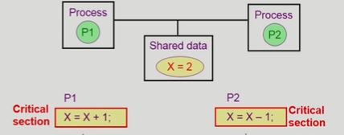

> 각 공유 데이터에 접근하는 코드인 X=X+1과 X=X-1이 Critical section이 된다.
>
> 그래서 한 프로세스가 공유데이터에 접근하는 Critical section에 들어가면 즉, 공유하는 데이터에 접근하는 코드를 실행중미녀,
> CPU를 뺏겨서 다른 프로세스에 넘어가더라도 공유하는 데이터에 접근하는 critical section에 들어가지 못하게 한다.
>
> critical section에서 빠져 나왔을 때 다른 것에서 접근할 수 있게 된다.
>
> 예를들어 P1에서 접근중일때 CPU가 P2로 넘어가게 되면 이미 critical section을 사용중이기 때문에 코드를 실행하지 못한다.

#### 🎈 프로그램적 해결법의 충족 조건

##### ✨ Mutual Exclusion(상호 배제)

- 프로세스 Pi가 critical section 부분을 수행 중이면 다른 모든 프로세스들은 그들의 critical section에 들어가면 안된다

##### ✨ Progress(진행)

- 아무도 critical section에 있지 않은 상태에서 critical section에 들어가고자 하는 프로세스가 있으면 critical section에 들어가게 해주어야 한다.

##### ✨ Bounded Waiting(유한 대기)

- 프로세스가 critical section에 들어가려고 요청한 후부터 그 요청이 허용될 때 까지 다른 프로세스들이 critical section에 들어가는 횟수에 한계가 있어야 한다.

- critical section에 들어가려는 프로세스가 3개가 있을 때 2개만 번갈아가면서 사용하고 한명은 왕따가 되는 상황을 해결하기 위함이다.

결국 위 총족조건들을 충족시켜야하는데,

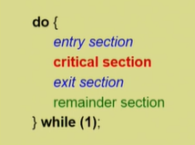

이런 함수를 보았을 때, 

entry section에서 들어갈 때 lock을 걸고, exit section에서 나올 때 lock을 풀어주면 되는 것이다.

이와 관련된 알고리즘을 한번 살펴보자

#### 🎈 critical-section 관련 알고리즘

##### ✨ Algorithm1

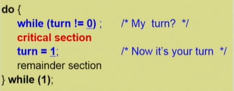

turn은 차례를 나타낸다. 0일때는 P0 프로세스가, 1일때는 P1 프로세스가 critical section에 들어간다.

위 코드에선 critical-section에서 작업을 끝내고 나오면서 turn을 1로 바꿔줌으로써 P1 프로세스가 다음 차례로 critical-section에 들어갈 수 있게 된다.

마찬가지로 P1 프로세스는 critical-section에서 작업을 마치고 다시 turn을 0으로 바꿔준다.

**위 알고리즘은 Mutual Exclusion을 만족하지만 Progress는 만족시키지 못한다.**

아무도 critical section에 있지 않은 상태에서 들어갈 수가 없다.

예를 들어서 P0이 연속적으로 critical section에 들어가려고 하지만 critical section이 **비어있더라고** turn 값이 1이기 때문에 들어갈 수가 없다. 즉, 꼭 P1이 들어가서 turn값을 바꿔줘야지만 P0이 다음으로 들어갈 수 있게 되는 것이다.

##### ✨ Algorithm2

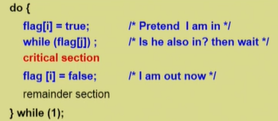

flag 변수를 활용한다.

flag는 어떤 특정한 프로세스가 critical section을 사용함을 뜻한다.

Pi프로세스가 들어갈 때 본인의 flag값을 true값으로 바꾸고

들어가기전에 다른 상대방이 아직 critical section에 있는지 체크를 하고 있다면 기다린다. 
(while문에 flag[j]값이 true면 j라는 상대방이 아직 critical section에 있는 것이다.)

그리고 본인(i) 차례가 되면 들어가서 작업을 하고 나올 때 본인의 값을 false로 초기화 시키고 나온다.

**위 알고리즘도 Mutual Exclusion을 만족하지만 Progress는 만족시키지 못한다.**

프로세스 i가 flag[i] = true 코드를 통해 깃발을 들고 나서 갑자기 cpu를 뺏겼다.

cpu를 뺏은 프로세스 k가 flag[k] = true 코드를 통해 깃발을 들고 이젠 i, k가 같이 j가 끝나길 기다린다.

k가 이제 critical section에 들어가려고 보니 while문에서 i 이녀석이 깃발을 들고 있다고 나오는 것이다.

i는 들어가기 전에 cpu를 뺏겨서 들어가지 못했는데 말이다.

결국 k, i는 서로 눈치만 보다가 빈 critical section에 들어가지 못한다는 문제점이 생긴다.

둘 다 2행까지만 수행 후 끊임 없이 양보하는 상황이 발생하게 되는 것이다.

##### ✨ Algorithm3 (Peterson's Algorithm)

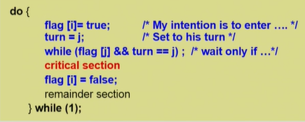

위 2 방법을 합친 방법이다.

while문을 보았을 때, 상대방의 flag가 true이고 현재 turn이 상대방이라면 프로세스 i는 기다리게된다.

하지만 둘중 하나라도 충족하지 않는다면 프로세스 i는 critical section에 들어간다. 작업한 뒤 나올 때 flag를 다시 false로 바꿔주고 다른 상대방이 들어갈 수 있게 해준다.
(i가 들어갈때 turn을 j(상대방)으로 바꿔주는데 바꿔줘도 상대방의 flag가 false이면 i는 들어가게된다.)

작업 중 cpu를 빼앗긴다 하더라도 Mutual Exclusion, Progess, Bounded Waiting 삼박자를 모두 만족시킨다.

하지만 Busy Waiting(=spin lock)이라는 문제점이 생긴다. (계속 CPU와 memory를 쓰면서 wait)

ㄴ while문을 계속 돌면서 상대방이 못들어가게 계속 lock을 하게된다. => 자원의 낭비가 발생! 비효율적!

위 알고리즘 3개는 결국 비슷한 맥락이다. 들어가기전에 lock을 걸고 나올 때 unlock을 하는 건데, 

코드가 길어진 이유는 interrupt가 발생할 수 있기 때문이다. 즉, 코드를 수행할때 interrupt가 끼어들어 다 수행하지 못하고 cpu를 뺏기는 것이 문제인 것이다.

이 문제는 sw적인 측면이 아니라 hw적으로 쉽게 고칠 수도 있다.

##### ✨ Synchronization Hardware

하드웨어적으로 Test & modify를 atomic하게 수행할 수 있도록 지원하는 경우 앞의 문제는 간단히 해결된다.

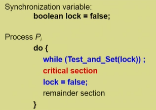

들어갈 때, 나올 때 Test_and_Set 함수를 실행하여 lock변수를 true, false 조절을 한다.

들어갈땐 lock을 1로, 나올때는 0으로 해서

만일 누가 들어갈 때 lock이 1인 경우 while문에 걸려서 기다리게된다.

##### ✨ Semaphores (추상 자료형)

사실 프로그래머가 앞의 작업을 하나하나 한다는 것은 굉장히 번거로운 일이다. Semaphores는 위 작업들을 추상화시킨다.

- Semaphore **`S`**

  - S는 정수값을 가질 수 있다. (정수값은 자원의 개수라고 생각하면 된다.)

  - 프로세스가 실행될 때 마다(P함수) 자원(S)를 가져가게 된다.

  - 아래 두가지 atomic 연산에 의해서만 접근 가능하다.

  - 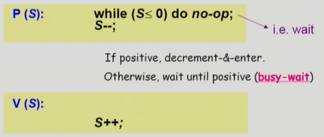

  - > P연산은 공유 데이터를 획득하는 과정 (lock을 거는 과정)
    >
    > => S값이 0보다 작은 경우 즉, 자원이 없는 경우 while문에 걸려 계속 기다린다.
    >      그러다가 누가 자원을 내놓으면 S값에 -1을 하고 자원을 가져간다.
    >
    > (=> 여기서도 busy-wait문제가 생긴다. 자원이 없는 경우 while문을 계속 돌면서 자원을 낭비시킨다.)
    >
    > V연산은 반납하는 과정 (unlock하는 과정)
    >
    > => 자원을 다 사용한 뒤 S값을 1 증가시킨다.

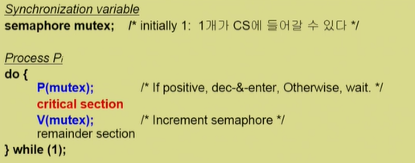

Semaphore를 적용시키면 위와 같은데 critical section 전후로 P와 V연산을 해준다.

##### ✨ Block / Wakeup 방식

busy-wait 문제를 해결하는 방법이다.

while문을 도는 것이 아니라 누군가 공유 데이터를 사용중이라면 다른 프로세스 자체를 block시켰다가 공유데이터를 갖고 있던 프로세스가 내놓으면 그때 block을 푸는 방식이다.

- Semaphore를 아래와 같이 정의한다

- 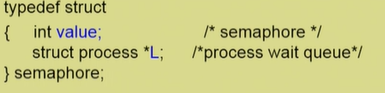

- > L이라는 하나의 구조적인 wait queue를 만든다.

- block과 wakeup을 아래와 같이 가정한다.

  - block : 커널은 block을 호출한 프로세스를 suspend시킨다. 이 프로세스의 PCB를 semaphore에 대한 wait queue에 넣는다.

    - 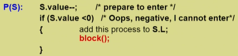

    - > Semaphore의 값 S에 1을 빼주고 S값이 음수이면 자원의 여분이 없다는 이야기이니까 이때는 이 프로세스를 S.L에 연결시켜놓고 block을 시킨다.

  - wakeup(P) : block된 프로세스 P를 wakeup 시킨다. 이 프로세스의 PCB를 ready queue로 옮긴다.

    - 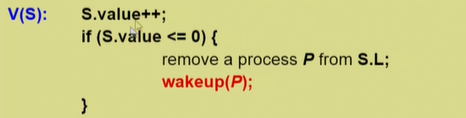

    - > 자원을 다 쓰고면 S값을 1 증가시켜서 자원을 반납했는데도 S값이 0보다 작으면 누군가 block된 상태가 있다는 뜻이 된다.(위에서 여럿이 (-)를 했다는 뜻이다.)
      > 그래서 잠들어있는 프로세스 하나를 S.L에서 빼서 wakeup 시켜준다.

  - 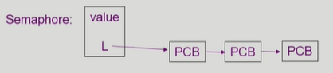

  - >  PCB를 계속 매달아 놓는 방식!! 잠들어있는 프로세스들을 연결시켜 놓는 것이다.

##### ✨ Which is better?

- Busy-wait v.s. Block/wakeup
- 보통은 Block/wakeup이 더 효율적일 것이다. while문에서의 자원의 낭비가 없기 때문이다
- 하지만 Block/wakeup도 block을 깨우는 과정에서 overhead가 충분히 존재할 수 있다.
- 그렇기 때문에 Critical section 길이가 그렇게 길지 않다면 Busy-wait한 방법도 나을 수 있다는 것!
  - Critical section의 길이가 긴 경우 Block/wakeup이 적당
  - Critical section 길이가 매우 짧은 경우 Block/wakeup 오버헤드가 busy-wait 오버헤드보다 커질 수 있음

#### 🎈 Deadlock and Starvation

> Semaphore에는 또 다른 문제점이 존재한다.

##### ✨ Deadlock

- 둘 이상의 프로세스가 서로 상대방에 의해 충족될 수 있는 event를 무한히 기다리는 현상
- 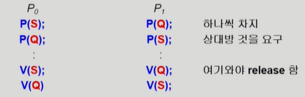
  - P0에서 P(S)를 실행한다.
  - CPU를 P1에 빼앗기게 된다.
  - P1이 P(Q)를 실행하고 P(S)를 실행하려고 보니
  - S는 이미 P0에서 가져갔기 때문에 무한하게 기다려야 된다.
  - V까지 가야 누구든 반환을 하게 되는데 그러한 일은 오지 않는다... 영원히...
- **자원을 얻는 순서를 똑같이 맞춰주면 해결이 된다.**
  (즉, P0과 P1 모두 S, Q 순서로!!)

##### ✨ Starvation

- indefinite blocking
- 프로세스가 suspend된 이유에 해당하는 세마포어 큐에서 빠져나갈 수 없는 현상
- (특정 프로세스들만 자원을 공유하고 다른 프로세스는 영원히 자기 차례가 오지않는 현상)

### 📒 Synchronization의 문제점

#### 🎈 Bounded-Buffer Problem (Producer-Consumer Problem)

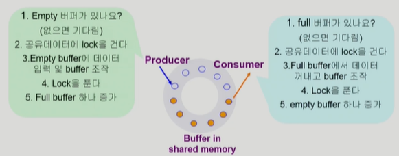

> *Buffer: 자료를 저장하는 어떠한 공간

##### ✨ 공유버퍼의 문제점1 (Lock관련, Shared data)

복수의 Producer와 Consumer 프로세스가 존재한다.

Producer는 버퍼에 데이터를 넣는 일을 한다. (주황색은 차있는 버퍼)

만일, 두 개의 Producer가 동시에 같은 공간에 데이터를 집어넣으면 문제가 발생하게 된다.

그래서 생산자가 비어있는 버퍼를 확인하고 데이터를 만들어서 집어 넣는 작업을 할때 공유 버퍼에 Lock을 걸어서다른 프로세스가 접근하지 못하게 처리해야 한다.

Consumer도 마찬가지로 한 공간에서 데이터를 복수의 Consumer가 꺼내가려 하면 문제가 발생한다.

그래서 Consumer도 데이터를 꺼내가고 싶으면 버퍼에 Lock을 걸어서 다른 Consumer 프로세스들이 접근하지 못하게 만들어줘야 한다.

- mutual exclusion => Need binary semaphore
  (shared data의 mutual exclusion을 위해)
- 즉, Lock을 위해 하나의 semaphore변수가 필요하다.

##### ✨ 공유버퍼의 문제점2 (버퍼의 유한성)

Producer만 계속 도착하여 소비되지는 않고 생산만 되면 결국에는 버퍼가 가득차게 되고 자원이 부족하게 된다.

결국, Consumer가 도착해서 자원의 여분을 만들어줄 때 까지 Producer는 이후에 계속 기다려야만 한다.

반대로, Consumer만 계속 도착해도 같은 문제점이 생긴다.

- resource count => Need integer semaphore
  (남은 full/empth buffer의 수 표시)
- 즉, 자원의 개수를 나타내기 위해 정수형 semaphore변수가 필요하다.

##### ✨ Semaphore를 활용한 문제 해결

> full: 차있는 버퍼의 개수, empth: 비어있는 버퍼의 개수, mutex: 버퍼를 하나의 프로세스만 사용하도록

#### 🎈 Readers and Writers Problem

> 읽는 프로세스와 쓰는 프로세스가 존재한다.

한 process가 DB(공유데이터)에 write 중일 때 다른 process가 접근하면 안된다.
(read는 동시에 여럿이 해도 됨)

기존에는 read와 write 작업을 할 때 각각 lock을 걸어서 작업을 해주면 되었는데, 

read의 경우 동시에 여럿이 해도 되기 때문에 lock을 걸면 오히려 비효율적으로 된다.

##### ✨ Solution

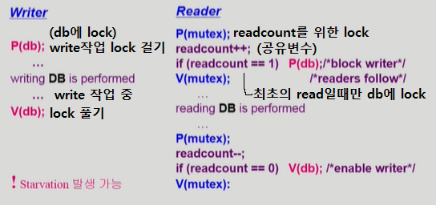

Reader 코드에서

최초의 read일 때만 db에 lock을 걸어서 읽는 도중에 write작업이 발생하지 않도록 해준다.

그리고 공유변수(readcount)를 통해서 각각의 read작업들은 같이 일어날 수 있도록 해주고

mutex라는 semaphore변수를 통해 readcount(공유변수)가 2개를 증가시켰는데 결국엔 하나만 증가되는 그러한 문제점을 방지해준다.

그리고 나서 V(mutex)를 통해 공유변수에 대한 lock을 풀어준다.

이후 read작업을 수행하고

마찬가지로 readcount를 조절할 때 lock을 걸었다 푸는 작업을 같이 해준다.

이때, 마지막으로 하는 read작업이라면(readcount == 0) db에 대한 lock을 풀어준다.

- Writer가 DB에 접근 허가를 아직 얻지 못한 상태에서는 모든 대기중인 Reader들을 다 DB에 접근하게 해준다.
- Writer는 대기 중인 Reader가 하나도 없을 때 DB 접근이 허용된다.
- 일단 Writer가 DB에 접근 중이면 Reader들은 접근이 금지된다.
- Writer가 DB에서 빠져나가야만 Reader의 접근이 허용된다.
- 공유데이터(Shared Data)
  - DB 자체
  - readcount (현재 DB에 접근 중인 Reader의 수)
- Synchronization variables
  - mutex (공유 변수 readcount를 접근하는 코드의 mutual exclusion 보장을 위해 사용)
  - db (Reader와 Writer가 공유 DB자체를 올바르게 접근하게 하는 역할)
- Starvation 문제점
  - Reader작업이 이루어지는 동안에는 Writer 작업은 계속 기다려야한다. 
    Reader작업이 계속 100개 1000개 들어올 때 Writer는 하염없이 기다린다.
  - 뭐 Queue에 우선순위를 둬서 Read작업 중에 우선순위인 Write작업은 이루어지도록 하여 문제를 해결할 수 있다.

#### 🎈 Dining-Philosophers Problem(식사하는 철학자 문제)

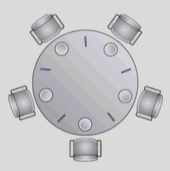

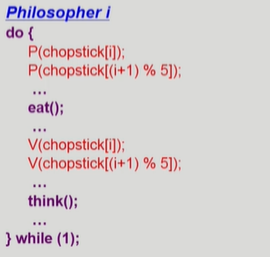

공유자원인 젓가락을 사용할 때는 Lock을 걸어서

옆에 있는 다른 철학자들은 그 젓가락을 사용하지 못하게 된다.

젓가락의 사용이 끝나면 Lock이 풀리게 되고 다른 철학자가 젓가락(공유자원)에 접근이 가능해 진다.

##### ✨ 앞의 Solution의 문제점

- Deadlock 가능성이 있다.
- 모든 철학자가 동시에 배가 고파져 왼쪽 젓가락을 집어버린 경우 
  (더 이상 오른쪽 젓가락은 사용할 수 없다.)

##### ✨ 해결방안

- 4명의 철학자만이 테이블에 동시에 앉을 수 있도록 한다.

- 비대칭

  - 짝수(홀수)철학자는 왼쪽(오른쪽) 젓가락부터 집도록

- 젓가락을 두개 모두 집을 수 있을 때에만 젓가락을 집을 수 있게 한다.

  - enum {thinking, hungry, eating} state[5] => 철학자의 상태
    semaphore self[5] = 0 => 철학자의 젓가락을 집을 수 있는 권한(0이면 양쪽 젓가락을 집을 수 없음을 나타냄)
    semaphore mutex = 1 => 철학자의 상태를 바꾸기 위한 공유변수 lock

  - 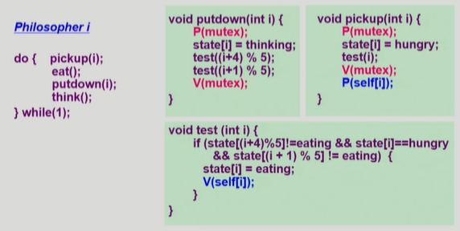

  - > 1. 철학자가 pickup 함수 호출
    > 2. 상태를 hungry로 바꾸고 철학자 i가 젓가락을 두개 다 잡을 수 있는 상태인지 test(i)로 체크
    > 3. 왼쪽 철학자 밥먹고 있지 않고 && 오른쪽 철학자 밥먹고 있지 않고 && 내가 hungry한 상태이면
    > 4. 그 철학자의 상태를 eating으로 바꾸어주고 젓가락을 잡을 권한(V(self[i]))를 준다.
    >    (권한을 1로 해줘서 젓가락을 잡을 수 있도록..)
    > 5. 권한 체크를 하고 P(self[i])에서 젓가락을 잡게 된다.
    > 6. 젓가락을 putdown 할때는 상태를 thinking으로 바꿔주고
    > 7. test((i+4) % 5) 왼쪽 철학자, test({i+1} % 5) 오른쪽 철학자를 체크하여 인접 철학자들이 젓가락을 잡을 권리를 갖도록 해준다.

### 📕 Monitor

#### 🎈 Semaphore의 문제점

- P, V 연산을 통해서 쉽게 만들었지만 그래도 코딩하기 힘들다.
- 정확성의 입증이 어렵다.
- 자발적 협력이 필요하다.
- 한번의 실수가 모든 시스템에 치명적인 영향을 준다.
- ex) 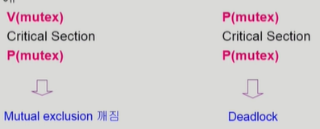
  - Critical Section 들어가기 전에 P연산을 해야하는데 잘못 코딩한 경우
  - P연산 V연산 해야하는데 P연산만 하도록 잘못 코딩한 경우

#### 🎈 Monitor

> 동시 수행중인 프로세스 사이에서 abstract data type의 안전한 공유를 보장하기 위한 high-levvel synchronization construct

특정 공유데이터에 접근할 수 있는 특정 프로시저를 정의해둔다.

그래서 A 공유 데이터에 접근하기 위해선 A 프로시저를 통해서 접근해야 하게 된다.

이렇게 하면 프로그래머 입장에서 Lock을 할 필요가 사라진다.

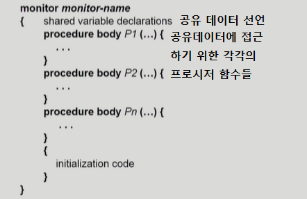

- 모니터 내에서는 한번에 하나의 프로세스만이 활동 가능

- 프로그래머가 동기화 제약 조건을 명시적으로 코딩할 필요 없음

- 프로세스가 모니터 안에서 기다릴 수 있도록 하기 위해 condition variable 사용
  condition x, y;

- Condition variable은 wait(프로세스 잠재우기)와 signal(깨우기) 연산에 의해서만 접근이 가능
  x.wait()
  x.wait()을 invoke한 프로세스는 다른 프로세스가
  x.signal()을 invoke하기 전까지 suspend된다.

  x.signal();
  x.signal()은 정확하게 하나의 suspend된 프로세스를 resume한다.
  Suspend된 프로세스가 없으면 아무 일도 일어나지 않는다.

- Bounded-Buffer Problem의 코드를 Monitor로 전환

  - 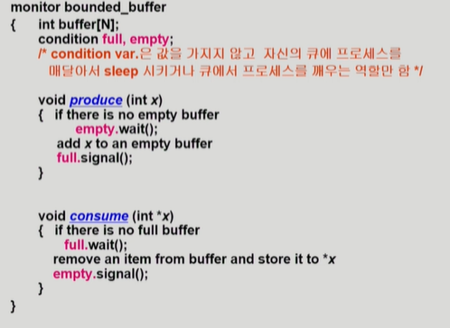

    > 1. 생산함수에서 비어있는 버퍼가 없다면 wait
    > 2. 비어있는 버퍼가 생기면 signal 보냄
    > 3. 소비함수에서 차있는 버퍼가 없다면 wait
    > 4. 차있는 버퍼가 생기면 signal 보냄
  
  - Lock하는 과정이 사라졌다.
    
    즉 Semaphore에서 P연산 V연산을 했던 것을 프로그래머가 일일히 코딩할 필요가 없어진다.
    
    또한 자원의 개수를 나타내는 변수 대신 condition을 활용하여
    
    버퍼의 현재 상태에 따라 wait, signal을 해준다.
    
    (Semaphore에서 Monitor로 conversion하는 것은 굉장히 손쉽다.)
    
  - Monitor의 목적 : 동시 접근을 회피하기 위함
  
    Semaphore의 목적 : 자원을 획득하기 위해 프로그래머가 P,V연산을 해주는 것
  
    이렇게 목적 자체가 약간 다르다.

