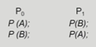
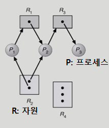
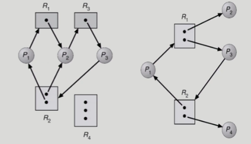
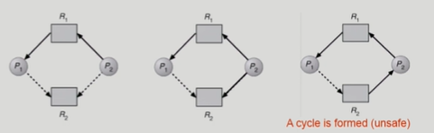
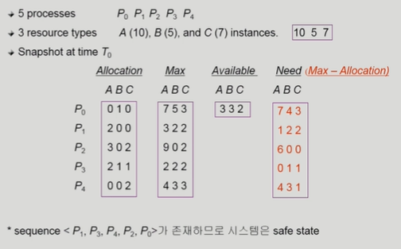

# 🤔 Deadlock

> 교착상태

## 🧐 Deadlock

### 📕 The Deadlock Problem

#### 🎈 Deadlock

- 일련의 프로세스들이 서로가 가진 자원을 기다리며 block된 상태

#### 🎈 Resource(자원)

- 하드웨어, 소프트웨어 등을 포함하는 개념
- ex. I/O device, CPU cycle, memory space, semaphore(또는 공유데이터)  등
- 프로세스가 자원을 사용하는 절차
  - Request(요청), Allocate(획득), Use(사용), Release(반납)
- Deadlock Example 1
  - 시스템에 2개의 tape drive가 있다.
  - 프로세스 P1과 P2각각이 하나의 tape drive를 보유한 채 상대방이 가진 다른 자원 하나를 기다리고 있다.
- Deadlock Example 2
  - Binary semaphores A and B
  - 

### 📗 Deadlock 발생의 4가지 조건

> 아래의 이유에 의해 Deadlock이 생기게 된다.

#### 🎈 Mutual exclusion(상호배제)

- 매 순간 하나의 프로세스만이 자원을 사용할 수 있다.
- (독점적으로 자원을 사용)

#### 🎈No preemption(비선점)

- 프로세스는 자원을 스스로 내어놓을 뿐 강제로 빼앗기지 않는다.

#### 🎈Hold and wait(보유대기)

- 자원을 가진 프로세스가 다른 자원을 기다릴 때 보유 자원을 놓지 않고 계속 가지고 있는다.

#### 🎈 Circular wait(순환대기)

- 자원을 기다리는 프로세스간에 사이클이 형성되어야 한다.
- 프로세스 P0, P1, .... Pn이 있을 때
  P0은 P1이 가진 자원을 기다리고,
  P1은 P2가 가진 자원을 기다리고,
  Pn-1은 Pn이 가진 자원을 기다린다.

### 📘 Resource-Allocation Graph(자원할당그래프)

> 자원 -> 프로세스 화살표의 의미는 해당 자원을 해당 프로세스가 갖고있다는 것
>
> 프로세스 -> 자원 화살표의 의미는 프로세스가 자원을 요청했다는 것
>
> 사각형 안에 작은 점들은 자원의 수를 나타냄

#### 🎈 어떤 그래프가 deadlock 상태인가?

> 왼쪽의 경우 R2에 인스턴스(점)이 2개가 있음에도 불구하고 싸이클이 2개가 만들어지기 때문에 deadlock 상태이다.
>
> 오른쪽의 경우 사이클이 하나고 자원에 인스턴스(점)이 2개이기 때문에 deadlock 상태가 아니다.

##### ✨ 그래프에 cycle이 없으면 deadlock이 아니다.

##### ✨ 그래프에 cycle이 없으면

- if only one instance per resource type, then deadlock

  (자원당 인스턴스(점)이 하나밖에 없으면 곧 deadlock을 의미한다.)

- if several instances per resource type, possibility of deadlock

### 📒 Deadlock의 처리방법

> Prevention, Avoidance : 강한 방법, deadlock을 미연에 방지
>
> Detection and recovery, Ignorance : 약한 방법, deadlock이 발생하도록 놔둠

#### 🎈 Deadlock Prevention

> deadlock에 들어가는 원천적인 조건을 차단하여 deadlock이 안되도록 하는 방법

##### ✨ 자원 할당 시 Deadlock의 4가지 필요 조건 중 어느 하나가 만족되지 않도록 하는 것

✨ **Mutual Exclusion**

- 공유해서는 안되는 자원의 경우 반드시 성립해야함

✨ **Hold and Wait**

- 프로세스가 자원을 요청할 때 다른 어떤 자원도 가지고 있지 않아야 한다.
- 방법1. 프로세스 시작 시 모든 필요한 자원을 할당받게 하는 방법 (자원에 대한 비효율성)
- 방법2. 자원이 필요한 경우 보유 자원을 모두 놓고 다시 요청

✨ **No Preemption**

- process가 어떤 자원을 기다려야 하는 경우 이미 보유한 자원이 선점됨
- 모든 필요한 자원을 얻을 수 있을 때 그 프로세스는 다시 시작된다.
- State를 쉽게 save하고 restore할 수 있는 자원에서 주로 사용(CPU, memory)

✨ **Circular Wait**

- 모든 자원 유형에 할당 순서를 정하여 정해진 순서대로만 자원 할당
- 예를들어 순서가 3인 자원 Ri를 보유 중인 프로세스가 순서가 1인 자원 Rj를 할당받기 위해서는 우선 Ri를 release해야한다.

✨ **해당 방법은 Deadlock을 막을 순 있으나, Utilization 저하, throughput 감소, starvation 문제가 있다.**

#### 🎈 Deadlock Avoidance

> 평생에 쓸 자원을 미리 알고있으면 자원 할당 시 deadlock 발생 가능 여부를 미연에 판단하여 자원을 줄지 말지 결정

✨ **자원 요청에 대한 부가적인 정보를 이용해서 deadlock의 가능성이 없는 경우에만 자원을 할당**

- 자원 요청에 대한 부가정보를 이용해서 자원 할당이 deadlock으로부터 안전한지를 동적으로 조사해서 안전한 경우에만 할당
- 가장 단순하고 일반적인 모델은 프로세스들이 필요로 하는 각 자원별 최대 사용량을 미리 선언하도록 하는 방법

✨ **시스템 state가 원래 state로 돌아올 수 있는 경우에만 자원 할당**

✨ **safe state**

- 시스템 내의 프로세스들에 대한 safe sequence가 존재하는 상태

✨ **safe sequence**

- 프로세스의 sequence <P1, P2,..., Pn>이 safe하려면 Pi(1<=i<=n)의 자원 요청이 "가용자원 + 모든 Pj의 보유자원"에 의해 충족되어야 함
- 조건을 만족하면 다음 방법으로 모든 프로세스의 수행을 보장
  - Pi의 자원 요청이 즉시 충족될 수 없으면 모든 Pj(j<i)가 종료될 때까지 기다린다.
  - Pi-1이 종료되면 Pi의 자원요청을 만족시켜 수행한다.

✨ **시스템이 safe state에 있으면 => no deadlock** 

✨ **시스템이 unsfae state에 있으면 => possibility of deadlock**

✨ **Deadlock Avoidance**

- 시스템이 unsafe state에 들어가지 않는 것을 보장

- 2가지의 경우 avoidance알고리즘

  - Single instance per resource types

    - Resource Allocation Graph algorithm 사용

    - 

      > (*자원 당 인스턴스가 하나뿐인 경우)
      >
      > 점선은 해당 프로세스가 평생에 한번은 가리키는 자원을 쓸 수도 있다는 표시
      >
      > 현재는 deadlock이 아니지만 점선이 실선이 되어 P1과 P2가 모두 R2에 자원을 요청하게 되면 deadlock 상태에 빠지게 된다.
      >
      > Avoidance는 최악의 상황을 가정하기 때문에 가운데 그림에서 점선이 연결되면 deadlock이라는 최악의 시나리오가 나오므로 애초에 P2가 R2에 요청을 할 때 자원을 할당하지 않게 한다.
      >
      > 즉, deadlock의 위험성이 있으면 애초부터 자원을 주지 않는다!

  - Multiple instances per resource types

    - Banker's Algorithm 사용

      - (*자원 당 인스턴스가 여러개인 경우)

        

        > A 10개, B는 5개, C는 7개의 인스턴스를 갖는다.
        >
        > Max에서 평생 사용할 맥시멈 자원을 미리 declare(선언)
        > (ex. P2는 평생을 쓰게 되면 A 9개, B 0개, C 2개 이렇게 되는 것이다.)
        >
        > Available는 현재 가용한 자원의 개수들이고
        >
        > 이제 Need와 가용자원을 비교하게 되는데
        >
        > P1의 경우 Need가 A 1개, B 2개, C 2개이고 Available로 충분히 커버가 가능하므로 자원을 할당한다.
        >
        > P0의 경우 Need가 A 7개, B 4개, C 3개이어서 Available로 커버가 불가능하므로 비록 1,0,1로 자원을 요청하더라도 만일 최대 요청시 가용자원을 넘어서 deadlock 가능성이 있으므로 자원을 주지 않고 기다리게 된다.
        > 나중에 다른 모든 프로세스가 끝나고 할당되었던 자원을 뱉어내어 가용자원이 여유가 되면 그때 준다.

#### 🎈 Deadlock Detection and recovery

✨ **Deadlock발생은 허용하되 그에 대한 detection 루틴을 두어 deadlock 발견 시 recover**

#### 🎈 Deadlock Ignorance

✨ **Deadlock을 시스템이 책임지지 않음**

✨ **UNIX를 포함한 대부분의 OS가 채택**

