# 🤔 Memory Management

> 메모리 관리

## 🧐 Logical vs Physical Address

### 🎈 Logical address(논리적 주소)

##### ✨ 프로세스마다 독릭접으로 가지는 주소 공간

##### ✨ 각 프로세스마다 0번지부터 시작

##### ✨ CPU가 보는 주소는 logical address임

### 🎈 Physical address

✨ **메모리에 실제 올라가는 위치**

## 🧐 주소 바인딩

> **주소를 결정하는 것**
>
> - Symbolic Address => Logical Address => Physical Address
>
> - (*Symbolic Address : 프로그래머 입장에서는 주소값이 아닌 변수명(Symbol)로 사용한다. 나중에 컴파일이 되면 숫자 주소(Logical Address)가 되는 것이다.)
>
> - 여기서 Logical Address에서 Physical Address로 넘어가는 시점은 언제인가?

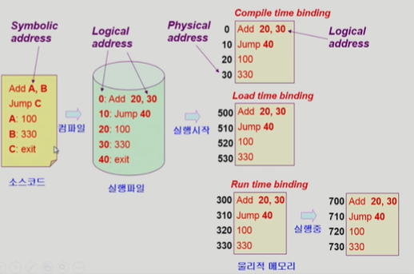

### 🎈 주소 결정 방법 3가지

- Compile time binding
- Load time binding
- Execution time binding

#### 📕 Compile time binding

✨ **주소 변환이 컴파일 시에 이뤄질 때**

✨ **물리적 메모리 주소(physical address)가 컴파일 시 알려짐**

✨ **시작 위치 변경시 재컴파일**

✨ **컴파일러는 절대 코드(absolute code)생성**
(컴파일 되어서 Logical address에 있는 코드를 절대코드)

✨ **항상 물리적 주소에 올릴 때 논리적 주소에 주어져있는 주소 그대로 올리기 때문에 물리적 메모리에 다른 주소는 비어있음에도 정해진 위치에만 올리게 되어 비효율적!!**

#### 📗 Load time binding

✨ **프로그램 실행이 시작될 때**

✨ **프로그램이 실행되어 메모리에 올라갈 때 물리적 메모리 주소가 결정됨**
		(500번 부터 비어있다면 500번 물리적 주소부터 올림)

✨ **Loader의 책임하에 물리적 메모리 주소 부여**

✨ **컴파일러가 재배치가능코드(relocatable code)를 생성한 경우 가능**
(항상 특정위치가 아니라 비어있는 어느 위치에든 올라 갈 수 있음)

#### 📙  Execution time binding (=Run time binding)

✨ **프로그램이 시작된 이후에도 실행하다가 중간에 물리적 메모리 주소가 바뀔수 있는 방법**

✨ **수행이 시작된 이후에도 프로세스의 메모리 상 위치를 옮길 수 있음**

✨ **CPU가 주소를 참조할 때마다 binding을 점검(address mapping table)**

✨ **하드웨어적인 지원이 필요 (ex. base and limit registers, MMU)**

### 🎈 MMU(Memory-Management Unit)

##### ✨ MMU

- logical address를 physical address로 매핑해주는 Hardware device
- 주소변환을 위한 하드웨어

##### ✨ MMU scheme

- 사용자 프로세스가 CPU에서 수행되며 생성해내는 모든 주소값에 대해 base register의 값을 더한다.

##### ✨user program

- 사용자 프로그램은 logical address만을 다룬다.
- 실제 physical address를 볼 수 없으며 알 필요가 없다.

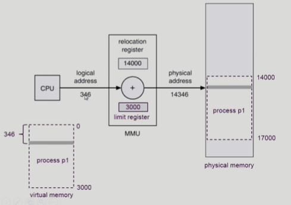

> 346이라는 논리적 주소를 변환할 때 MMU라는 하드웨어에서 변환을 하는데 
> 가장 기본적인 변환으로 register 2개를 사용하여 변환한다.
>
> - Relocation register(=base register) : 접근할 수 있는 물리적 메모리 주소의 최소값
> - Limit register : 논리적 주소의 범위
>
> register 공간의 limit이 3000이어서 0~3000범위의 가상 메모리를 만들고
> (limit register는 프로그램의 크기를 담고 있음)
>
> 물리 메모리에는 프로세스 p1이 14000번부터 할당이 되어 있으므로 14000에서 346만큼 떨어진 14346이 주소가 할당된다.

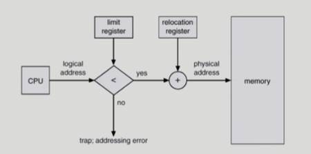

> 만일 CPU가 논리주소를 요청했을 때, limit register는 limit보다 큰 주소를 요청했는지를 확인한다.
>
> 만일 더 크다면 trap에 걸리게 되고 cpu의 운영권이 프로그램에서 OS로 넘어가서 왜 trap이 걸렸는지 파악을 한다. 그래서 프로그램에 대한 처리를 하게 된다.(악의적인 프로그램이라면 응징을!!)

### 🎈 Some Terminologies

몇가지 용어

- Dynamic Loading

- Dynamic Linking

- Overlays

- Swapping

#### 📕 Dynamic Loading

> Loading: 메모리로 올리는 것
>
> Dynamic Loading: 메모리에 동적으로 올린다!!

✨ **프로세스 전체를 메모리에 미리 다 올리는 것이 아니라 해당 루틴이 불려질 때 메모리에 load하는 것**

✨ **memory utilization의 향상**

✨ **가끔씩 사용되는 많은 양의 코드의 경우 유용**(ex. 오류 처리 루틴)

✨ **운영체제의 특별한 지원 없이 프로그램 자체에서 구현 가능(OS는 라이브러리를 통해 지원 가능)**

#### 📘 Dynamic Linking

✨ **Linking을 실행 시간까지 미루는 기법**

✨ **Static linking**

- 라이브러리가 프로그램의 실행 파일 코드에 포함됨
- 실행 파일의 크기가 커짐
- 동일한 라이브러리를 각각의 프로세스가 메모리에 올리므로 메모리 낭비(ex. printf 함수의 라이브러리 코드)

✨ **Dynamic linking**

- 링크는 소스코드를 하나로 묶는걸 링크라고 하는데 이때 라이브러리 코드는 동적으로 링크시키는 것

- 라이브러리가 실행 시 연결(link) 됨
- 코드 실행하다가 라이브러리 호출되는 부분에 이르면,
- 라이브러리 호출 부분에 라이브러리 루틴의 위치를 찾기 위한 stub이라는 작은 코드를 둠
- 라이브러리가 이미 메모리에 있으면 그 루틴의 주소로 가고 없으면 디스크에서 읽어옴
- 운영체제의 도움이 필요

#### 📗 Overlays

✨ **메모리에 프로세스의 부분 중 실제 필요한 정보만을 올림**

✨ **프로세스의 크기가 메모리보다 클 때 유용**

✨ **운영체제의 지원없이 사용자에 의해 구현(프로그래머의 코딩에 의해 구현)**

✨ **작은 공간의 메모리를 사용하던 초창기 시스템에서 수작업으로 프로그래머가 구현**

- Manual Overlay
- 프로그래밍이 매우 복잡

#### 📙 Swapping

✨ **Swapping**

- 프로세스를 일시적으로 메모리에서 backing store로 쫓아내는 것

✨ **Backing store (=swap area)**

- 디스크: 많은 사용자의 프로세스 이미지를 담을 만큼 충분히 빠르고 큰 저장 공간

✨ **Swap in / Swap out**

- 일반적으로 중기 스케줄러(swapper)에 의해 swap out 시킬 프로세스 선정
- priority-based CPU scheduling algorithm
  - priority가 낮은 프로세스를 swapped out 시킴
  - priority가 높은 프로세스를 메모리에 올려 놓음
- Compile time 혹은 load time binding에서는 원래 모메리 위치로 swap in 해야 함
- Execution time binding에서는 추후 빈 메모리 영역 아무 곳에나 올릴 수 있음
- swap time은 대부분 transfer time (swap되는 양에 비례하는 시간)임

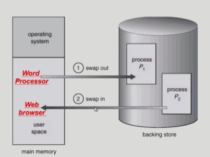

### 🎈 Allocation of Physical Memory

> 물리적 메모리 관리

#### 📗 **메모리는 일반적으로 두 영역으로 나뉘어 사용된다.**

✨ **OS 상주 영역**

- interrupt vector와 함께 낮은 주소 영역 사용

✨ **사용자 프로세스 영역**

- 높은 주소 영역 사용

#### 📕 사용자 프로세스 영역의 할당 방법

✨  **Contiguous allocation(연속할당)**

- 프로그램이 메모리의 한군데에 통째로 올라가는 것

- 각각의 프로세스가 메모리의 연속적인 공간에 적재되도록 하는 것

- ###### Fixed partition allocation(고정 분할 방식)

  - 물리적 메모리를 몇 개의 영구적 분할(partition)로 나눔
  - 분할의 크기가 모두 동일한 방식과 서로 다른 방식이 존재
  - 분할당 하나의 프로그램 적재
  - 융통성이 없음
    - 동시에 메모리에 load되는 프로그램의 수가 고정됨
    - 최대 수행 가능 프로그램 크기 제한
  - Internal fragmentation 발생 (external fragmentation도 발생)

- ###### Variable partition allocation(가변 분할 방식)

  - 프로그램의 크기를 고려해서 할당
  - 분할의 크기, 개수가 동적으로 변함
  - 기술적 관리 기법 필요
  - External fragmentation 발생

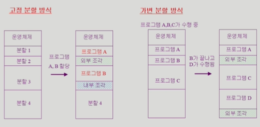

> **고정분할방식**: 프로그램A의 경우 분할1에 크기가 맞아서 들어가고, B의 경우 커서 2를 건너 뛰고 3에 들어간다. 
>
> 외부조각(External fragmentation) : 프로그램이 너무 커서 건너 뛰어 발생
>
> 내부조각(Internal fragmentation) : 프로그램이 분할 공간보다는 작아서 발생
>
> **가변분할방식**: 분할을 나눠놓지 않고 프로그램의 크기만큼 할당을 하는 것이다.
>
> 프로그램B가 끝나고 나면 그 공간에 D가 들어가기에는 작아서 외부조각으로 남고 D는 다른 공간에 들어간다.

- ###### Hole

  - 가용 메모리 공간
  - 다양한 크기의 hole들이 메모리 여러 곳에 흩어져 있음
  - 프로세스가 도착하면 수용가능한 hole을 할당
  - 운영체제는 다음의 정보를 유지
    - a) 할당공간    b) 가용공간(hole)

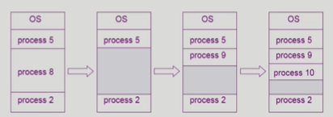

- ###### Dynamic Storage-Allocation Problem

  - 가변 분할 방식에서 size n인 요청을 만족하는 가장 적절한 hole을 찾는 문제
  - First-fit
    - Size가 n 이상인 것 중 최초로 찾아지는 hole에 할당
  - Best-fit
    - Size가 n 이상인 가장 작은 hole을 찾아서 할당
    - Hole들의 리스트가 크기순으로 정렬되지 않은 경우 모든 hole의 리스트를 탐색해야함
    - 많은 수의 아주 작은 hole들이 생성됨
  - Worst-fit
    - 가장 큰 hole에 할당
    - 역시 모든 리스트를 탐색해야 함
    - 상대적으로 아주 큰 hole들이 생성됨
    - First-fit과 Best-fit이 보다 속도와 공간 이용률 측면에서 효과적인 것으로 알려짐

- ###### compaction

  - external fragmentation문제를 해결하는 한 가지 방법
  - 사용 중인 메모리 영역을 한군데로 몰고 hole들을 다른 한 곳으로 몰아 큰 block을 만드는 것
  - 매우 비용이 많이 드는 방법
  - 최소한의 메모리 이동으로 compaction하는 방법(매우 복잡한 문제)
  - compaction은 프로세스의 주소가 실행 시간에 동적으로 재배치 가능한 경우에만 수행될 수 있다.

✨ **Noncontiguous allocation(불연속할당)**

- 하나의 프로세스가 메모리의 여러 영역에 분산되어 올라갈 수 있음

- ##### Paging

  - (기존 레지스터 2개로 주소변환을 하는 방법으로는 불가능함)
    (각각의 페이지들이 어느 주소에 올라가있는지 알아내기 위해선 페이지별로 주소를 계산해줘야함)

  - Process의 virtual memory를 동일한 사이즈의 page단위로 나눔

  - Virtual memory의 내용이 page단위로 noncontiguous하게 저장됨

  - 일부는 backing storage에, 일부는 physical memory에 저장

  - ###### Basic Method
    
    - physical memory를 동일한 크기의 frame으로 나눔
    - logical memory를 동일 크기의 page로 나눔(frame과 같은 크기)
    - 모든 가용 frame들을 관리
    - page table을 사용하여 logical address를 physical address로 변환
      (각각의 page마다 물리적 메모리 어디에 있는지 table에 기록)
      (page table은 프로그램마다 별도로 테이블이 존재해야 한다.)
    - External fragmentation 발생 안함
    - Internal fragmentation 발생 가능
      (프로그램의 크기가 꼭 page 크기와 꼭 들어맞을 순 없다.)
    
  - 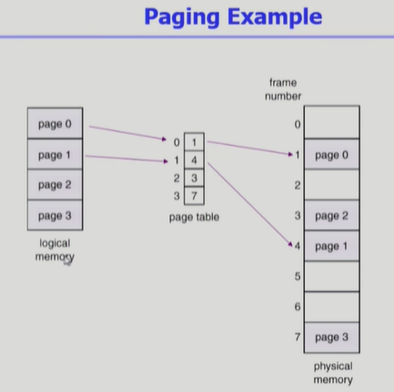

  - > n번째 페이지를 주소변환하고 싶으면 위에서 n번 엔터리를 탐색하고 몇번 프레임에 들어가있는지 확인한다.

  - 

  - > 주소변환 시 페이지 테이블을 사용한다. 그래서 주소에서 앞부분(p)이 페이지 번호가 되고
    >
    > 뒷부분이 페이지 내에서 얼만큼 떨어져있는지 나타내는 offset이 된다.

  - ###### page table

    - 위 그림에서는 테이블에 페이지가 4개이지만 사실 한 프로그램을 페이지로 쪼개면 100만개 정도는 필요하며, 각 프로그램마다 테이블이 필요하기 때문에 register나 cache에 table을 올려놓기에는 용량이 너무 크다.

    - page table은 main memory에 상주 (용량이 크기때문에)

    - Page-table base register(PTBR)가 page table을 가리킴 
      (기존 주소변환 하던 레지스터가 해당 역할을 함)

    - Page-table length register(PTLR)가 테이블 크기를 보관
      (기존 주소변환 하던 레지스터가 해당 역할을 함)

    - 모든 메모리 접근 연산에는 2번의 memory access 필요

    - page table 접근 1번, 실제 data/instruction 접근 1번

    - 속도 향상을 위해 associative register 혹은 translation look-aside buffer(TLB)라 불리는 고속의 lookup hardware cache 사용

    - 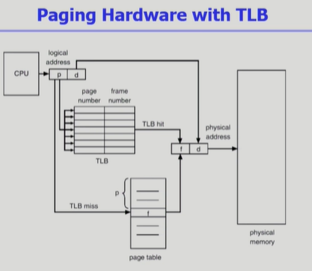

    - > TLB는 주소변환을 위한 캐시메모리
      >
      > page table에서 빈번히 참조되는 일부 엔트리를 캐싱하는 것이다.
      >
      > - Associative registers(TLB): parallel search가 가능
      >   - TLB에는 page table 중 일부만 존재
      > - Address translation
      >   - page table 중 일부가 associative register에 보관되어 있음
      >   - 만약 해당 page #가 associative register에 있는 경우 곧바로 frame #를 얻음
      >   -  그렇지 않은 경우 main memory에 있는 page table로부터 frame #를 얻음
      >   - TLB는 context switch 때 flush (remove old entries)

  - ###### 2단계 page table

    - 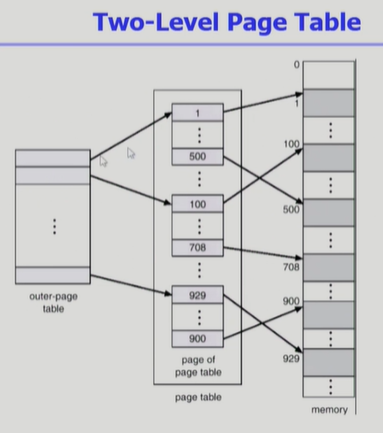
    - 페이지 테이블을 위한 공간을 줄이기 위함이 목적이다.
    - 현대의 컴퓨터는 address space가 매우 큰 프로그램 지원
      - 32 bit address 사용 시: 2^32 (4GB)의 주소 공간
        - page size가 4K 시 1M개의 page table entry 필요
        - 각 page entry가 4B시 프로세스당 4M의 page table 필요
        - 그러나, 대부분의 프로그램은 4G의 주소 공간 중 지극히 일부분만 사용하므로 page table공간이 심하게 낭비됨
    - page table 자체를 page로 구성
    - 사용되지 않는 주소 공간에 대한 outer page table의 엔트리 값은 NULL(대응하는 inner page table이 없음) 즉, 실제로 사용되는 페이지만 page table에 만들어져서 공간을 갖고 그렇지 않은 것들은 NULL로 빈공간으로 있게 된다. 그래서 상당히 많은 공간이 비어서 남아 있을 수 있게 된다.(1단계 page table에서는 빈공간이 있을 수가 없음)
      => 공간 효율성!!
    
  - ###### 다단계 page table

    - Address space가 더 커지면 다단계 페이지 테이블 필요
    - 각 단계의 페이지 테이블이 메모리에 존재하므로 logical address의 physical address 변환에 더 많은 메모리 접근 필요
    - TLB를 통해 메모리 접근 시간을 줄일 수 있음 (TLB: 주소변환을 위한 일종의 캐시메모리)

  - Memory Protection

    - 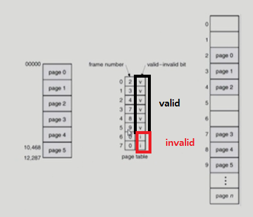
    - Page table의 각 entry마다 아래의 bit를 둔다.
    - Protection bit
      - page에 대한 접근 권한 (read/ write/ read-only)
    - Valid-invalid bit
      - valid는 해당 주소의 frame에 그 프로세스를 구성하는 유효한 내용이 있음을 뜻한다.(접근허용)
      - invalid는 해당 주소의 frame에 유효한 내용이 없음을 뜻한다.(접근불허)
        (프로세스가 그 주소 부분을 사용하지 않는 경우
        해당 페이지가 메모리에 올라와 있지 않고 swap area에 있는 경우)

  - ###### Inverted Page Table

    - page table이 매우 큰 이유

      - 모든 process별로 그 logical address에 대응하는 모든 page에 대해 page table entry가 존재
        (각 프로세스마다 테이블이 각각 존재하기 때문에 공간 차지가 굉장히 컸음)
      - 대응하는 page가 메모리에 있든 아니든 간에 page table에는 entry로 존재

    - Inverted page table

      - 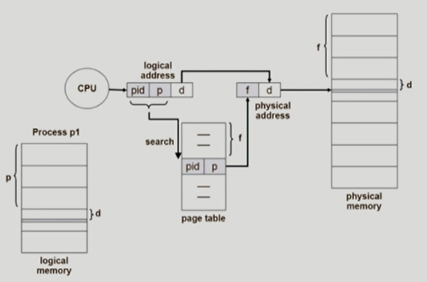

      - > 원래는 page table이 프로세스마다 존재했는데 inverted는 시스템 안에 딱 1개만 존재한다.
        >
        > 논리적 주소의 p 페이지를 찾으려고 한다면 page table의 엔트리를 다 뒤져보고 f번째에 있다는 것을 알아내는 것이다.
        >
        > 시간적으로는 오래걸리지만 공간적으로는 page table이 한개만 있기 때문에 효율적이다.(pid(process id)는 p가 무슨 프로세스의 p인지를 알려주는 아이디값)
        >
        > - Page frame 하나당 page table에 하나의 entry를 둔 것
        >
        > - 각 page table entry는 각각의 물리적 메모리의 page frame이 담고 있는 내용 표시(process-id, process의 logical address)
        > - 단점: 테이블 전체를 탐색해야함(속도 문제 발생)
        > - 조치: associative register 사용 (expensive)

  - ###### Shared Page(Rentrant Code, Pure code)

    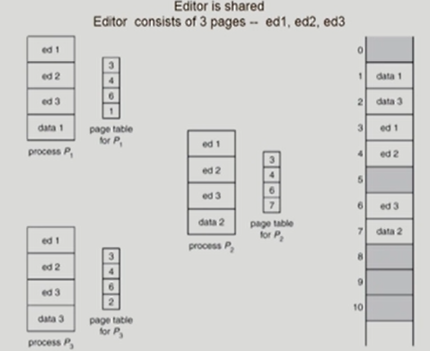

    > ed1, ed2, ed2 같은 logical address

    - 중복된 코드를 같이 쓰는 개념
    - Shared code
      - 프로세스가 다르더라도 코드가 같다면 같은 frame으로 매핑을 시켜 메모리에 한 값만 올림
      - read-only로 하여 프로세스 간에 하나의 code만 메모리에 올림
      - Shared code는 모든 프로세스의 logical address sapce에서 동일 한 위치에 있어야함
        (즉, 항상 동일한 logical address를 가져야 한다.)
    - Private code and data
      - 각 프로세스들은 독자적으로 메모리에 올림
      - Private data는 logical address space의 아무 곳에 와도 무방

- ##### Segmentation

  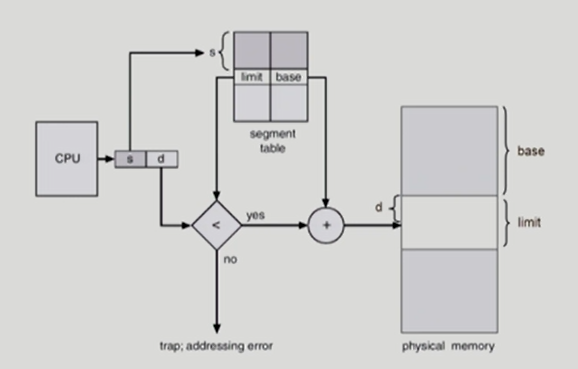

  > CPU가 논리주소를 주게되면 두 부분으로 나뉘는데(세그먼트번호, 세그먼트에서 떨어진 오프셋)
  >
  > s만큼의 번호를 갖고 그만큼 떨어진 테이블의 엔트리에 가면 해당 세그먼트가 물리적 주소에 어떤 위치에 있는지의 정보를 갖고 있다.
  >
  > limit과 base정보를 갖는데, limit은 세그먼트의 길이를 나타낸다.(페이지에서는 페이지의 길이가 다 같았음)
  >
  > s는 세그먼트 번호인데 만일 이 프로그램이 세그먼트 3개로 구성되어 있는데 s가 5번이다? 말이 안되는 것!! 잘못된 요청!!

  - 프로그램의 주소공간을 의미있는 세그먼트로 나누는 것

  - 프로그램은 의미 단위인 여러 개의 segment로 구성

    - 작게는 프로개름을 구성하는 함수 하나하나를 세그먼트로 정의
    - 크게는 프로그래 전체를 하나의 세그먼트로 정의 가능
    - 일반적으로 code, data, stack 부분이 하나씩의 세그먼트로 정의됨

  - Segment는 다음과 같은 logical unit들이다.

    - main() / function / global variables / stack / symbol table, arrays

  - 

  - ###### Segmentation Architecture

    - Logical address는 두 가지로 구성: `<segment-number, offset>`

    - Segment table

      - each table entry has:
        - base - starting physical address of the segment
        - limit - length of the segment
      - Segment-table base register(STBR)
        - 물리적 메모리에서의 segment table의 위치
      - Segment-table length register(STLR)
        - 프로그램이 사용하는 segment의 수
        - segment number s is legai if s < STLR
        - s는 세그먼트 번호인데 만일 이 프로그램이 세그먼트 3개로 구성되어 있는데 s가 5번이다? 말이 안되는 것!! 잘못된 요청!!
        - 그래서 STLR과의 숫자값을 비교해서 잘못된 요청인지를 구분하여 trap에 걸리게 한다.
          (마찬가지 그림에서 d(offset)가 limit보다 커버리면 엉뚱한 곳에서 찾게되므로 또 trap)

    - Protection

      - 각 세그먼트 별로 protection bit가 있음
      - Each entry:
        -Valid bit = 0 => illegal segment
        -Read/Write/Execution 권한 bit (각 세그먼트마다 권한 부여 가능)

    - Sharing

      - shared segment

      - same segment number

        (segment는 의미 단위이기 때문에 공유와 보안에 있어 paging보다 뛰어나다.)

      - 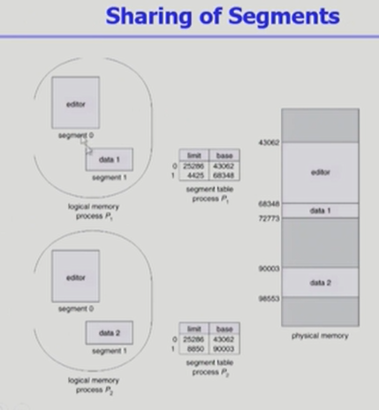

    - Allocation

      - first fit / best fit
      - external fragmentation 발생
        (segment의 길이가 균일하지 않으므로 가변분할 방식에서와 동일한 문제점들이 발생)

  

  

- ##### Paged Segmentation

  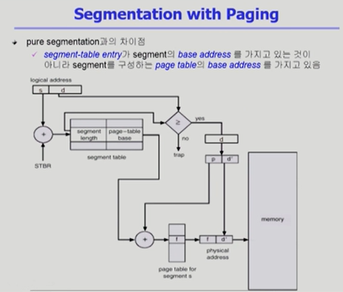

  - 세그먼트를 여러 페이지로 구성하는 기법

  - 메커니즘

    - 메모리에 올릴때는 page기법을 사용하기 때문에 allocation 문제가 사라지게 된다.
    - 일단, 각 논리주서는 s(세그먼트 번호), d(오프셋)으로 구성이 되고
    - segment table을 통해서 주소 변환 정보를 얻고(정보: segment의 길이, page-table의 시작위치)
    - d를 p(page 번호)와 d'(오프셋)값으로 쪼갠다.
    - page-table로 가서 page-table의 시작위치와 p(page 번호)를 활용하여 엔트리에 가서 주소 변환 정보를 얻어서(f, frame 번호) 
    - frame번호와 d'를 가져와서 물리적 주소를 만들어 데이터를 메모리에 올린다.

  - 세그먼트 당 페이지 테이블을 갖게 된다.(예전에는 프로세스 당 페이지 테이블)

    

**🎇 Point!**

어떤 프로세스가 논리적인 주소를 갖고 있고

CPU가 논리적 주소를 주면 그것을 물리적인 메모리 주소로 변환하여 메모리 참조를 한다.

여기서 운영체제가 하는 것은 하나도 없다. 모두 물리적인 하드웨어가 하는 작업들이다.

