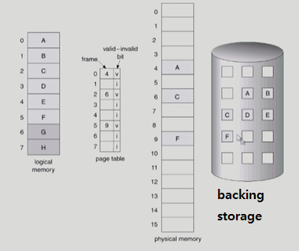
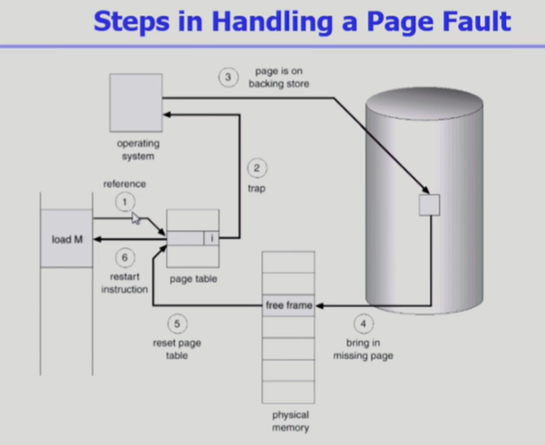
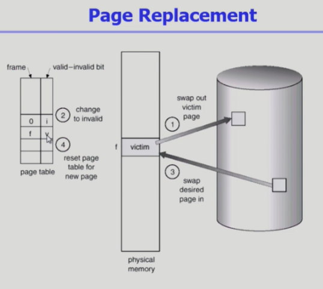
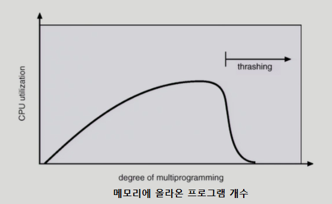
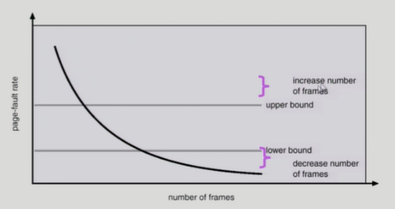

# 🤔Virtual Memory

## 🧐 가상 메모리

### 🎈 Demand Paging

> 페이지가 요청이 되었을 때 그때 그것을 메모리에 올린다.

##### ✨ 실제로 필요할 때 page를 메모리에 올리는 것

- I/O양의 감소
- Memory 사용량 감소
  (이상한 사람들이 입력값을 넣었을 때를 대비한 가끔 쓰이는 코드를 모두 메모리에 올리는 경우 메모리가 낭비가 될 수 있다. 이때, 필요한 것들만 메모리에 올려 메모리를 효율적으로 사용한다.)
- 빠른 응답 시간
- 더 많은 사용자 수용

##### ✨ Valid / Invalid bit의 사용

- invalid의 의미

  - 사용되지 않는 주소 영역인 경우
  - 페이지가 물리적 메모리에 없는 경우

- 처음에는 모든 page entry가 invalid로 초기화

- address translation 시에 invalid bit이 set되어 있으면 => `page fault`
  (CPU가 논리주소를 보고 주소변환하려고 봤더니 invalid 즉, 요청한 주소가 물리적 메모리에 없는 경우 page fault가 발생
  그러면 CPU는 자동적으로 운영체제(OS)로 넘어가게 된다. 운영체제가 CPU를 가지고 fault난 페이지를 메모리에 올리게 된다.)

- 

  > 필요한 것들만 우선적으로 물리적 메모리에 올려놓고 나머지는 storage(swap 영역)에 올려 놓는다.
  >
  > A,C,F는 실제로 물리적 메모리에 올려져있기 때문에 bit가 v이고 나머지는 i인 것이다.
  >
  > 그리고 현재 프로그램을 구성하는 페이지는 A~F까지이고 G,H는 사용이 안된다
  >
  > 이때, 사용안되는 페이지에 대해서는 invalid로 bit를 준다.

#### 📕 Page Fault

##### ✨ invalid page를 접근하면 MMU가 trap을 발생시킨다.(page fault trap)

##### ✨ Kernel mode로 들어가서 page fault handler가 invoke된다.

##### ✨ 다음의 순서로 page fault를 처리한다.

1. Invalid reference? (eg. bad address, protection violation) => abort process
2. Get an empty page frame (없으면 뺏어온다: replace)
3. 해당 페이지를 disk에서 memory로 읽어온다.
   - disk I/O가 끝나기까지 이 프로세스는 CPU를 preempt 당함(block)
   - Disk read가 끝나면 page tables entry 기록, valid/invalid bit = "valid"
   - ready queue에 process를 insert => dispatch later
4. 이 프로세스가 CPU를 잡고 다시 running
5. 아까 중단되었던 instruction을 재개한다.

> 1: 페이지 테이블에서 주소변환을 하려고 했는데 invalid임을 확인
> 2: 해당 페이지가 메모리에 없다는 소리이니까 trap이 걸려서 cpu가 os로 넘어가게 된다.
> 3: 운영체제는 backing storage에 있는 페이지를 찾는다.
> 4: 페이지를 메모리에 올린다.
> 5: 올려진 메모리의 번호를 페이지 테이블 entry에 적고 invalid를 valid 상태로 바꾼다.
> 6: 다시 instruction 실행
>
> **🤨 Free frame이 없는 경우**
>
> - Pace replacement(os가 하는 일)
>
>   - 어떤 frame을 빼앗아올지 결정해야 함
>   - 곧바로 사용되지 않을 page를 쫓아내는 것이 좋음
>   - 동일한 페이지가 여러 번 메모리에서 쫓겨났다가 다시 들어올 수 있음
>
> - Replacement Algorithm
>
>   - page-fault rate를 최소화하는 것이 목표
>   - 알고리즘 평가: 푸어진 page reference string에 대해 page fault를 얼마나 내는지 조사
>   - reference string의 예 : 1, 2, 3, 4, 1, 2, 5, 1, 2, 3, 4, 5
>
>   
>
>   > 1: victim(쫓아낼 페이지)을 backing storage로 쫓아낸다.
>   > 2: 쫓아낸 페이지의 테이블을 invalid로 바꾼다.
>   > 3: 가지고 오려던 페이지를 메모리에 올린다.
>   > 4: 가지고 온 페이지의 테이블을 valid로 바꿔준다.
>
> - Optimal Algorithm
>
>   - page fault를 가장 적게 하는 알고리즘
>   - MIN(OPT): 가장 먼 미래에 참조되는 page를 replace
>   - 해당 알고리즘은 미래를 알고있다는 것을 가정하기 때문에 실제 상황에서 사용하기에는 불가능
>   - 다만 다른 알고리즘의 성능에 대한 upper bound를 제공한다. (비교 지표로 사용)
>   - 미래를 모르면?
>     과거를 참고해서 알고리즘을 짠다 => FIFO, LRU ...
>
> - FIFO(First In First Out) Algorithm
>
>   - 먼저 들어온 것을 먼저 내쫓음
>   - 이 알고리즘은 page frames을 늘려줬는데도 성능이 더 나빠지는 경우가 발생할 수 있다.(FIFO Anomaly)
>
> - LRU(Least Recently Used) Algorithm
>
>   - 가장 많이 사용되는 알고리즘
>   - 가장 오래 전에 참조된 것을 지움
>   - O(1) complexity
>
> - LFU(Least Frequently Used) Algorithm
>
>   - 참조 횟수가 가장 적은 페이지를 지움
>   - O(n) complexity (최소 heap을 사용할 경우 O(log n) complexity)
>   - 최저 참조횟수인 page가 여럿 있는 경우
>     - LFU 알고리즘 자체에서는 여러 page중 임의로 선정한다.
>     - 성능 향상을 위해 가장 오래 전에 참조된 page를 지우게 구현할 수도 있다.
>   - 장단점
>     - LRU처럼 직전 참조 시점만 보는 것이 아니라 장기적인 시간 규모를 보기 때문에 page의 인기도를 좀 더 정확히 반영할 수 있다.
>     - 다만, 참조 시점의 최근성을 반영하지 못한다.
>     - 추가적으로 LRU보다 구현이 복잡하다.

### 🎈 다양한 캐슁 환경

##### ✨ 캐슁 기법

- 한정된 빠른 공간(=캐쉬)에 요청된 데이터를 저장해 두었다가 후속 요청시 캐쉬로부터 직접 서비스하는 방식
- paging system 외에도 cache memory, buffer caching, Web caching 등 다양한 분야에서 사용

##### ✨ 캐쉬 운영의 시간 제약

- 교체 알고리즘에서 삭제할 항목을 결정하는 일에 지나치게 많은 시간이 걸리는 경우 실제 시스템에서 사용할 수 없음
- Buffer caching이나 Web caching의 경우 O(1)에서 O(log n)정도까지 허용
- Paging system인 경우
  - page fault인 경우에만 OS가 관여함
  - 페이지가 이미 메모리에 존재하는 경우 참조시각 등의 정보를 OS가 알 수 없음
  - O(1)인 LRU의 list 조작조차 불가능
  - ※ Paging System에서 LRU, LFU 가능한가?
    - 기본적으로 CPU가 프로세스를 돌릴때 논리적 주소를 통해 page table에 주소 변환을 요청하고 메모리에 있으면 해당 메모리에서 가지고 온다.
      이때, OS는 전혀 관여하지 않는다. 모두 HW적으로 구현이 된다.
    - 그렇기 때문에 만일 page fault가 발생해서 메모리에서 추방해야할 필요가 생겼을 때, OS는 메모리에 드문 드문 접근했기 때문에 모든 페이지의 접근 시간을 모르기 때문에 LRU, LFU가 사용이 불가능하다.
    - 즉, 메모리에 있는 페이지에 대해서는 OS에 cpu제어권이 넘어오지 않기 때문에 정보 부족으로 LRU, LFU 사용 불가능!!
    - 그래서 사용하는 알고리즘이 **Clock Algorithm**

#### 📗 Clock Algorithm

> Paging system에서 쫓아내기 위해 사용하는 알고리즘

✨ **LRU의 근사 알고리즘**

✨ **여러 명칭으로 불림**

- Second chance algorithm
- NUR(Not Used Recently)또는 NRU (Not Recently Used)

✨ **Reference bit을 사용해서 교체 대상 페이지 선정 (circular list)**

- reference bit : 페이지를 읽고 valid라면 그 페이지의 reference bit을 1로 설정 (최근에 참조 되었음을 표시)
  => 해당 작업은 운영체제가 아닌 하드웨어가 해준다.
- reference bit이 1이면 최근에 참조 되었다를 의미

✨ **reference bit가 0인 것을 찾을 때까지 포인터를 하나씩 앞으로 이동**

✨ **포인터 이동하는 중에 reference bit 1은 모두 0으로 바꿈**

✨ **Reference bit이 0인 것을 찾으면 그 페이지를 교체**

✨ **한 바퀴 되돌아와서도(=second chance) 0이면 그때에는 replace 당함**

✨ **자주 사용되는 페이지라면 second chance가 올 때 1**

> 각각의 네모가 페이지 프레임들이다.
>
> 다음의 메커니즘으로 움직인다.
>
> - 하드웨어는 최근에 참조된 페이지들의 reference bit를 1로 바꾸면서 가고
> - OS는 reference bit가 1일 경우 0으로 바꾸면서 가서 0을 만나면 그걸 쫓아낸다.
> - 0일 경우에는 참조가 없었다는 것이니까 그것부터 쫓아내는 것으로 의사결정을 한다.
> - 즉, 어느정도 참조가 안된 페이지를 쫓아낸다.

✨ **Clock algorithm의 개선**

- reference bit와 modified bit(dirty bit)을 함께 사용
- reference bit = 1 : 최근에 참조된 페이지
- modified bit = 1 : 최근에 변경된 페이지 (I/O를 동반하는 페이지)
  - 쫓아낼 때 modified bit이 0인 경우에는 메모리에서 write 작업이 없었음을 뜻하니까 그냥 backing storage로 보내면 된다.
  - 1인 경우에는 write 작업이 있었다는 뜻이니까 backing storage에 수정한 것을 반영하고 쫓아낸다.
- 그래서 가능하면 modified와 reference가 모두 0인 것들을 우선적으로 쫓아낸다.

### 🎈 Page Frame의 allocation

> 각 process에 얼마만큼의 page frame을 할당할 것인가?

##### ✨ 필요성

- 메모리 참조 명령어 수행 시 명령어, 데이터 등 여러 페이지 동시 참조

  - 명령어 수행을 위해 최소한 할당외어야 하는 frame의 수가 있음

- Loop를 구성하는 page들은 한꺼번에 allocate 되는 것이 유리함

  - 최소한의 allocation이 없으면 매 loop 마다 page fault

  - 예를들어 for문을 도는데 길이가 3인 리스트에 어떤 프로그램에 3공간을 할당하면 
    해당 리스트를 반복해서 돌 때 page fault가 발생하지 않을 것이다.

    하지만, 3중 2를 할당한다면 계속 page fault가 발생할 것이다.

#### 📙  Allocation Scheme

✨ **Equal allocation**

- 모든 프로세스에 똑같은 갯수 할당

✨ **Proportional allocation**

- 프로세스 크기에 비례하여 할당

✨ **Priority allocation**

- 프로세스의 priority에 따라 다르게 할당

#### 📗 Global vs Local Replacement

✨ **Global replacement**

- Replace시 다른 process에 할당된 frame을 빼앗아 올 수 있다.
- Process 별 할당량을 조절하는 또 다른 방법
- FIFO, LRU, LFU 드으이 알고리즘을 global replacement로 사용시에 해당
- Working set, PFF 알고리즘 사용

✨ **Local replacement**

- 자신에게 할당된 frame 내에서만 replacement
- FIFO, LRU, LFU 등의 알고리즘을 process별로 운영시

### 🎈 Thrashing

> 프로그램의 수가 적을 때 I/O를 하러 갈때는 CPU가 놀기때문에 utilization이 초반엔 낮음
>
> 수가 많아지면 utlization이 높아짐
>
> 일정 수를 넘어가면 thrashing 발생!!

✨ **프로세스의 원활한 수행에 필요한 최소한의 page frame 수를 할당 받지 못한 경우 발생**

✨ **Page fault rate이 매우 높아짐**

✨ **CPu utilization이 낮아짐**

- 프로그램이 많아지고 각 프로그램에 할당되는 메모리 양이 적어지게되면 프로그램들이 계속 page fault가 발생하게 되서 CPU가 놀게됨

✨ **OS는 MPD(Multiprogramming degree)를 높여야 한다고 판단**

✨ **또 다른 프로세스가 시스템에 추가됨 (higher MPD)**

✨ **프로세스는 page의 swap in/swap out으로 매우 바쁨**

✨ **대부분의 시간에 CPU는 한가함**

✨ **low throughput**

✨ **이걸 막기 위해선 MPD를 조절해주어야 한다.**

- 프로그램이 어느정도의 메모리를 확보할 수 있도록 알고리즘을 짜줘야함
- **Working-Set Model**,  **PFF(Page-Fault Frequency)**

#### 📕 Working-Set Model

> 프로세스마다 일정량의 메모리 확보하도록

##### ✨ Locality of reference

- 프로세스는 특정 시간 동안 일정 장소만을 집중적으로 참조한다.
- 집중적으로 참조되는 해당 page들의 집합을 locality set이라 함

✨ **Working-set Model**

> 어떤 프로그램이 실행되면서 그 순간에 메모리에 꼭 올라와 있어야 하는 page들의 집합 : Working set

- Locality에 기반하여 프로세스가 일정 시간 동안 원활하게 수행되기 위해 한꺼번에 메모리에 올라와 있어야 하는 page들의 집합을 `Working Set`이라 정의한다.
- Working Set 모델에서는 process의 working set 전체가 메모리에 올라와 있어야 수행되고 그렇지 않을 경우 모든 frame을 반납한 후 swap out
  - 만약 공간이 5개 필요한데 3개만 있는 경우 3개를 그냥 반납하고 swap out한다.
- Thrashing을 방지함
- Multiprogramming degree를 결정함

#### 📙 PFF(Page-Fault Frequency) Scheme

✨ **page-fault rate**의 상한값과 하한값을 둔다

- Page fault rate이 상한값을 넘으면 frame을 더 할당한다.
- Page fault rate이 하한값 이하이면 할당 frame 수를 줄인다.

✨ **빈 frame이 없으면 일부 프로세스를 swap out**

### 🎈 Page Size의 결정

✨ **Page size를 감소시키면**

- 페이지 수 증가
- 페이지 테이블 크기 증가
- Internal fragmentation 감소
- Disk transfer의 효율성 감소
- 필요한 정보만 메모리에 올라와 메모리 이용이 효율적
  - Locality의 활용 측면에서는 좋지 않음

✨ **Trend**

- Larger page size