# 🤔 File System Implementation

## 🧐 Allocation of File Data in Disk

> 디스크에 파일을 저장하는 방법

### 🎈 Contiguous Allocation

> 연속할당

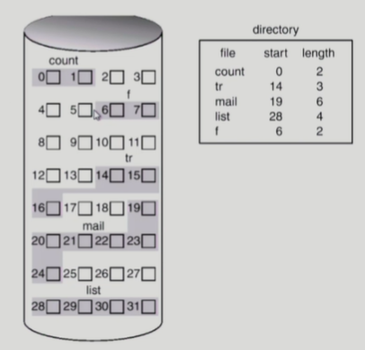

##### ✨ 디스크 상에 연속해서 저장하는 방법

##### ✨ 단점

- external fragmentation(외부조각)
  - 할당된 공간 안에서 각각의 파일의 크기가 균등하지 않기 때문에 남는 공간이 생김
  - 17, 18에는 크기가 큰 것은 넣을 수 없는 외부조각 발생
- File grow가 어려움 (즉, 파일의 크기가 고정됨)
  - 예를 들어 14, 15, 16이 크기가 6으로 되면 17, 18 포함해서 5칸이니까 할당이 안됨.
  - file 생성 시 얼마나 큰 hole을 배당할 것인가?
  - grow 기능 vs 낭비 (internal fragmentation)
    - 예를들어 14, 15, 16에 미리 17, 18을 더 할당해주어서 대비한다면 17, 18은 당장에는 사용하지 않으니 내부조각이 발생

##### ✨ 장점

- Fast I/O
  - 한번의 seek/rotation으로 많은 바이트 transfer
  - Realtime file 용으로, 또는 이미 run 중이던 process의 swapping용
- Direct access(=random access) 가능
  -  예를들어 22번에 접근하고 싶다면 19, 20, 21, 22 이렇게 순차적으로 접근하는 것 이 아니라 19에서 길이를 아니까 22까지만큼의 수 3을 더해서 바로 접근

 

### 🎈 Linked Allocation

> 파일 데이터를 연속적이 아닌 빈 위치 아무데에나 위치시킴

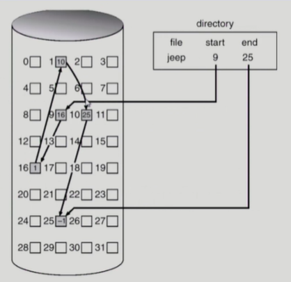

##### ✨ 장점

- External fragmentation(외부조각) 발생 안 함
  - 비어있는 어디든 들어가기 때문

##### ✨ 단점

- No random access
  - 직접 접근이 안됨. 각 블록을 돌아야 다음 위치를 알 수 있기 때문!!
- Reliability 문제
  - 한 sector가 고장나 pointer가 유실되면 많은 부분을 잃음
- Pointer를 위한 공간이 block의 일부가 되어 공간 효율성을 떨어뜨림

##### ✨ 변형

- File-allocation table(FAT) 파일 시스템
  - 포인터를 별도의 위치에 보관하여 reliability와 공간효율성 문제 해결

### 🎈 Indexed Allocation

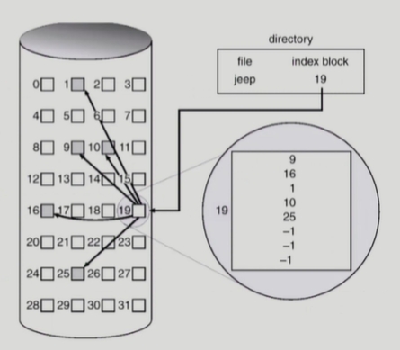

> 파일이 어디에 저장되어있는지 위치정보를 하나의 섹터에 저장
>
> Linked와 다르게 인덱스를 보고 바로 직접접근이 가능

##### ✨ 장점

- 외부조각이 발생하지 않음
- Direct access 가능

##### ✨ 단점

- Small file의 경우 공간 낭비(실제로 많은 file들이 small)
- Too Large file의 경우 하나의 block으로 index를 저장하기에 부족
  - 해결방안
  - 1. linked scheme
       (마지막 위치에 또 다른 인덱스 블록을 가리키게 함)
    2. multi-level index
       (인덱스 블록을 2개 이상 거쳐서 가는 방법)

## 🧐 UNIX 파일시스템의 구조

### 🎈 UNIX 파일시스템

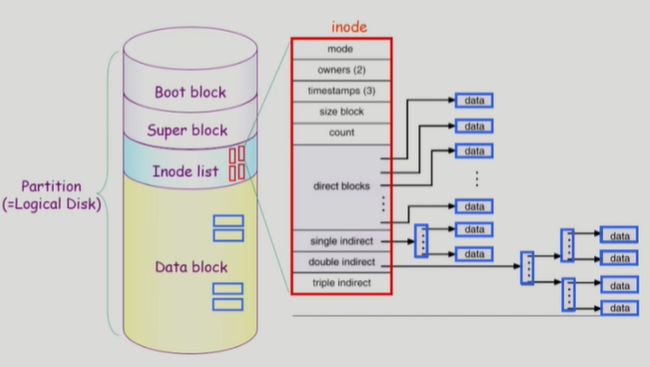

✨ **Boot block**: 부팅에 필요한 정보(bootstrap loader)

✨ **Superblock**: 파일 시스템에 관한 총체적인 정보를 담고 있음

✨ **Inode**: 파일 이름을 제외한 파일의 모든 메타 데이터를 저장

✨ **Data block**: 파일의 실제 내용을 보관

### 🎈 FAT File System

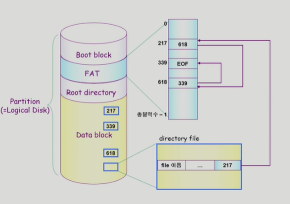

> 파일의 메타데이터 중 일부를 FAT이라는 곳에 보관한다. (위치정보들)
>
> FAT에 배열의 크기는 Data block의 크기만큼이다. Data block에 n개 만큼 있다면 FAT 배열의 크기도 n이 된다.
>
> 이를 통해 Linked Allocation의 한계점들을 극복함.

## 🧐 Free-Space Management

> 중간 중간의 빈 공간들을 관리하는 방법

### 🎈 Bit map or bit vector

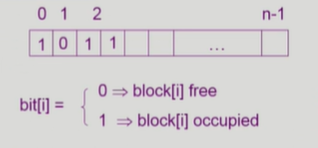

✨ **Bit map은 부가적인 공간을 필요로 함**

✨ **연속적인 n개의 free block을 찾는데 효과적**

✨ **블록이 사용중인지 아닌지를 0과 1로 나타냄**

- 파일 시스템이 할당할땐 1로 아닐땐 0으로 바꿔주면서 관리

### 🎈 Linked list

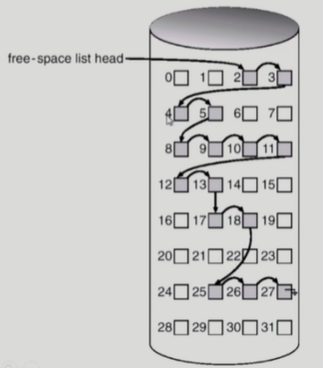

✨ **모든 free block들을 링크로 연결 (free list)**

✨ **연속적인 가용공간을 찾는 것은 쉽지 않다**

✨ **공간의 낭비가 없다**

### 🎈 Grouping

✨ **linked list 방법의 변형**

✨ **첫번째 free block이 n개의 pointer를 가짐** (인덱스 역할을 함)

- n-1 pointer는 free data block을 가리킴
- 마지막 pointer가 가리키는 block은 또 다시 n pointer를 가짐

### 🎈 Counting

✨ **프로그램들이 종종 여러 개의 연속적인 block을 할당하고 반납한다는 성질에 착안**

✨ **(first free block, # of contiguous free blocks)을 유지**

## 🧐 Directory Implementation

> 디렉토리를 어떻게 구현하는지
> (*디렉토리 : 그 디렉토리 밑에 있는 파일의 메타데이터를 관리하는 특수한 파일)

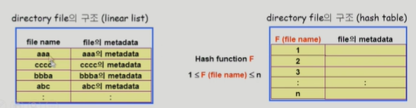

### 🎈 Linear list

✨ **<file name, file의 metadata>의 list**

✨ **구현이 간단**

✨ **디렉토리 내에 파일이 있는지 찾기 위해서는 linear search 필요(time-consuming, 시간이 많이 소요)**

### 🎈 Hash Table

✨ **linear list + hashing**

✨ **Hash table은 file name을 이 파일의 linear list의 위치로 바꾸어줌**

✨ **search time을 없앰**

- 해싱을 해서 해당 값 안에 있는 것만 찾으면 되기 때문에 시간적으로 더 효율이 좋다.

✨ **Collision 발생 가능**

### 🎈 File의 metadata의 보관 위치

✨ **디렉토리 내에 직접 보관**

✨ **디렉토리에는 포인터를 두고 다른 곳에 보관**

- inode, FAT 등

### 🎈 Long file name의 지원

✨ **<file name, file의 metadata>의 list에서 각 entry는 일반적으로 고정 크기**

✨ **file name이 고정 크기의 entry 길이보다 길어지는 경우 entry의 마지막 부분에 이름의 뒷 부분이 위치한 곳의 포인터를 두는 방법**

✨ **이름의 나머지 부분은 동일한 directory file의 일부에 존재**

## 🧐 VFS & NFS

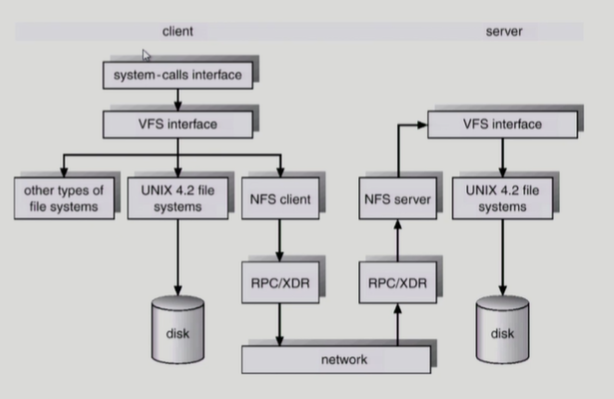

### 🎈 Virtual File System(VFS)

✨ **서로 다른 다양한 file system에 대해 동일한 시스템 콜 인터페이스 (API)를 통해 접근할 수 있게 해주는 OS의 layer**

### 🎈 Network File System(NFS)

✨ **분산 시스템에서는 네트워크를 통해 파일이 공유될 수 있음**

✨ **NFS의 분산 환경에서의 대표적인 파일 공유 방법임**

## 🧐 Page Cache & Buffer Cache

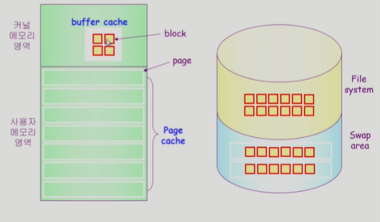

### 🎈 Page Cache

✨ **Virtual memory의 paging system에서 사용하는 page frame을 caching의 관점에서 설명하는 용어**

✨ **Memory-Mapped I/O를 쓰는 경우 file의 I/O에서도 page cache 사용**

### 🎈 Memory-Mapped I/O

✨ **File의 일부를 virtual memory에 mapping 시킴**

✨ **매핑시킨 영역에 대한 메모리 접근 연산을 파일의 입출력을 수행하게 함**

### 🎈 Buffer Cache

✨ **파일시스템을 통한 I/O연산은 메모리의 특정 영역인 buffer cache 사용**

✨ **File 사용의 locality 활용**

- 한번 읽어온 block에 대한 후속 요청 시 buffer cache에서 즉지 선달

✨ **모든 프로세스가 공용으로 사용**

✨ **Replacement algorithm필요(LRU, LFU 등)**

### 🎈 Unified Buffer Cache

✨ **최근의 OS에서는 기존의 buffer cache가 page cache에 통합됨**

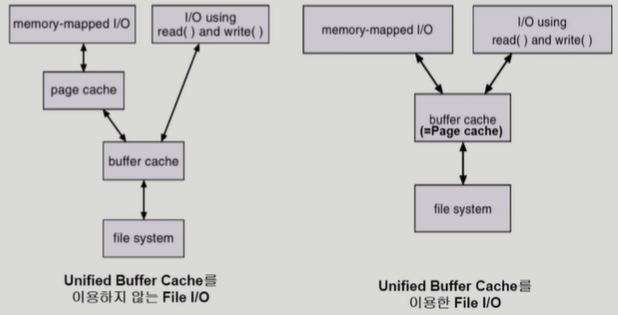

#### 🎨 프로그램의 실행

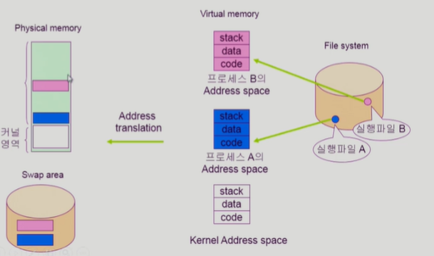

