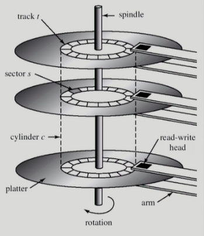
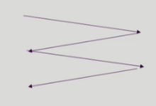
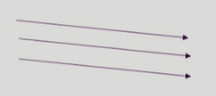
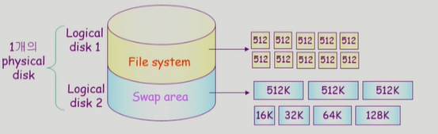
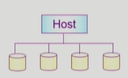

# 🤔 Disk Management and Scheduling

## 🧐 Disk Management and Scheduling

### 🎈 Disk Structure

##### ✨ logical block

- 디스크의 외부에서 보는 디스크의 단위 정보 저장 공간들
- 주소를 가진 1차원 배열처럼 취급
- 정보를 전송하는 최소 단위

##### ✨ Sector

> 디스크를 관리하는 최소의 단위

- Logical block이 물리적인 디스크에 매핑된 위치
- Sector 0은 최외각 실린더의 첫 트랙에 있는 첫 번째 섹터 (하나의 약속)

### 🎈 Disk Management

✨ **Physical formatting (Low-level formatting)**

> 하드디스크 제품이 만들어졌을 때 formatting이 되어서 나옴 (크기가 커진 현재 포매팅 작업이 오래걸림)

- 디스크를 컴트롤러가 읽고 쓸 수 있도록 섹터들로 나누는 과정
- 각 섹터는 **header** + 실제 **data**(보통 512bytes) + **trailer**로 구성
- header와 trailer는 sector number, ECC(Error-Correcting Code)등의 정보가 저장되며 controller가 직접 접근 및 운영
  - ECC: data의 finger print같은 느낌

✨ **Partitioning**

- 디스크를 하나 이상의 실린더 그룹으로 나누는 과정
- OS는 이것을 독립적 disk로 취급(logical disk)

✨ **Logical formatting**

- 파일 시스템을 만드는 것
- FAT, inode, free space 등의 구조 포함

✨ **Booting**

- ROM에 있는 'small bootstrap loader'의 실행
- sector 0 (boot block)을 load하여 실행
- sector 0은 'full Bootstrap loader program'
- OS를 디스크에서 load하여 실행(운영체제의 커널을 실행하는 것)

### 🎈 Disk Scheduling

✨ **Access time의 구성**

> 디스크를 접근하는 Access타임은 세가지로 구성

- Seek time
  - 헤드를 해당 실린더로 움직이는데 걸리는 시간
- Rotational latency
  - 헤드가 원하는 섹터에 도달하기까지 걸리는 회전 지연 시간
  - seek time보다는 적은 시간을 차지
- Transfer time
  - 실제 데이터의 전송 시간

✨ **Disk bandwidth**

- 단위 시간 당 전송된 바이트의 수

✨ **Disk Scheduling**

- seek time을 최소화하는 것이 목표
- Seek time === seek distance

### 🎈 Disk Scheduling Algorithm

✨ **FCFS** (First Come First Service)

✨ **SSTF** (Shortest Seek Time First)

- 들어온 요청 중 가장 가까운 위치인 것 부터 처리
- 디스크 헤드의 이동거리가 줄어들지만
- starvation 문제가 발생 가능하다.
  (가까운 요청들이 계속 들어오면 먼 것들은 처리를 못하게 된다.)

✨ **SCAN** 

- 가장 간단하면서 획기적인 스케줄링
- 엘리베이터 스케줄링

- disk arm이 디스크의 한쪽 끝에서 다른쪽 끝으로 이동하며 가는 길목에 있는 모든 요청을 처리한다.
- 다른 한쪽 끝에 도달하면 역방향으로 이동하며 오는 길목에 있는 모든 요청을 처리하며 다시 반대쪽 끝으로 이동한다.
- 문제점 : 실린더 위치에 따라 대기 시간이 다르다.
                 가장자리의 위치는 버스를 놓치면 한 긴 로테이션을 기다려야 한다.

✨ **C-SCAN** 

- 헤드가 한쪽 긑에서 다른쪽 끝으로 이동하며 가는 길목에 있는 모든 요청을 처리
- 다른 쪽 끝에 도달했으면 요청을 처리하지 않고 곧바로 출발점으로 다시 이동
- SCAN보다 균일한 대기 시간을 제공

✨ **N-SCAN** 

- SCAN의 변형 알고리즘
- 일단 arm이 한 방향으로 움직이기 시작하면 그 시점 이후에 도착한 job은 되돌아올 때 service

✨ **LOOK & C-LOOK**   

- SCAN이나 C-SCAN은 헤드가 디스크 끝에서 끝으로 이동
- LOOK과 C-LOOK은 헤드가 진행 중이다가 그 방향에 더 이상 기다리는 요청이 없으면 헤드의 이동방향을 즉시 반대로 이동한다.

#### 📕 Disk-Scheduling Algorithm의 결정

✨ **SCAN, C-SCAN 및 그 응용 알고리즘은 LOOK, C-LOOK 등이 일반적으로 디스크 입출력이 많은 시스템에서 효율적인 것으로 알려져 있음**

✨ **File의 할당 방법에 따라 디스크 요청이 영향을 받음**

✨ **디스크 스케줄링 알고리즘은 필요할 경우 다른 알고리즘으로 쉽게 교체할 수 있도록 OS와 별도의 모듈로 작성되는 것이 바람직하다.**

### 🎈 Swap-Space Management

> 물리적 디스크를 파티셔닝을 통해 논리적 디스크로 나누고
>
> 각가의 논리적 디스크를 File system이나 Swap area 용도로 나눠 독립적으로 사용할 수 있다.

✨ **Disk를 사용하는 두 가지 이유**

- memory의 volatile한 특성 => file system
- 프로그램 실행을 위한 memory 공간 부족 => swap space (swap area)

✨ **Swap-space**

- Virtual memory system에서는 디스크를 memory의 연장 공간으로 사용
- 파일 시스템 내부에 둘 수도 있으나 별도 partition 사용이 일반적
  - 공간효율성보다는 속도 효율성이 우선
  - 일반 파일보다 훨씬 짧은 시간만 존재하고 자주 참조됨
  - 따라서, block의 크기 및 저장 방식이 일반 파일시스템과 다름

### 🎈 RAID

✨ **RAID(Redundant Array of Independent Disks)**

- 여러 개의 디스크를 묶어서 사용

✨ **RAID의 사용 목적**

- 디스크 처리 속도 향상
  - 여러 디스크에 block의 내용을 분산 저장
  - 병렬적으로 읽어 옴 (interleaving, striping)
- 신뢰성(reliability) 향상
  - 동일 정보를 여러 디스크에 중복 저장
  - 하나의 디스크가 고장(failure)시 다른 디스크에서 읽어옴 (Mirroring, shadowing)
  - 단순한 중복 저장이 아니라 일부 디스크에 parity를 저장하여 공간의 효율성을 높일 수 있다.