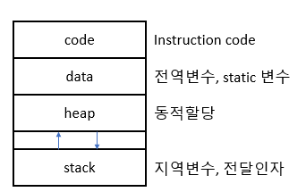
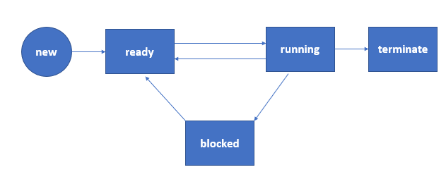
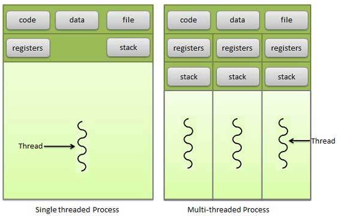
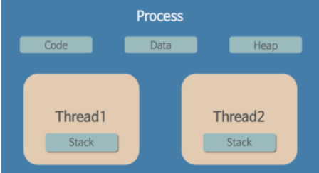

# 🤔 프로세스 & 스레드

## 🧐 프로세스

### 🎈 프로세스란?

- 프로세스는 실행 중에 있는 프로그램을 의미한다.
- 디스크로부터 메모리에 적재되어 CPU의 할당을 받을 수 있는 것을 말한다.
- 스케줄링의 대상이 되는 작업(task)과 같은 의미로 사용된다.
- 프로세스 내부에는 최소 하나의 스레드(thread)를 가지고 있는데, 실제로는 스레드 단위로 스케줄링을 하게 된다.
- 하드디스크에 있는 프로그램을 실행하면 실행을 위해서 **메모리 할당**이 이루어지고, 할당된 메모리 공간으로 바이너리 코드가 올라가게 된다. 이 순간부터 **프로세스**라고 불린다.

##### ✨프로세스 제어 블록(Process Control Block, PCB), 프로세스의 구성

> 각 프로세스는 운영체제에서 PCB에 의해 표현된다.
> (리눅스는 TCB, 태스크 제어 블록)

PCB는 특정 **프로세스에 대한 중요한 정보를 저장**하고 있는 운영체제의 자료구조이다.

운영체제는 프로세스를 관리하기 위해 프로세스의 생성과 동시에 고유한 PCB를 생성한다.

프로세스는 CPU를 할당받아 작업을 처리하다가 프로세스 전환이 발생하면 진행하던 작업을 저장하고 CPU를 반환해야 하는데, 이때 작업의 진행 상황을 모두 PCB에 저장하게 된다.

이후 다시 CPU를 할당받게 되면 PCB에 저장되어 있던 내용을 불러와 이전에 종료됐던 시점부터 다시 작업을 수행한다.

###### ※ PCB에 저장되는 정보

- 프로세스 식별자:(Process ID, PID)
  - 운영체제가 각 프로세스를 식별하기 위해 부여된 프로세스 식별번호
- 프로세스 상태
  - new, ready, running, waiting, terminated 등의 상태
  - CPU는 프로세스를 빠르게 교체하면서 실행하기 때문에 실행중인 프로세스도 있고 대기 중인 프로세스도 있다.
- 프로그램 카운터
  - 프로세스가 다음에 실행할 명령어의 주소
- CPU 레지스터
- CPU 스케쥴링 정보
  - 프로세스의 우선순위, 스케줄 큐에 대한 포인터 등
- 메모리 관리 정보
  - 페이지 테이블 또는 세그먼트 테이블 등과 같은 정보를 포함
- 입출력 상태 정보
  - 프로세스에 할당된 입출력 장치들과 열린 파일 목록
- 어카운팅 정보
  - 사용된 CPU 시간, 시간제한, 계정 번호 등

### 🎈 프로세스의 메모리 구조

- Code영역: 프로그램을 실행시키는 실행 파일 내의 명령어들이 올라간다.
  (흔히 소스코드가 이 영역에 올라간다.)
- Data영역: 전역변수, static 변수의 할당
- Heap영역: 동적할당을 위한 메모리 영역
- Stack영역: 지역변수, 함수 호출 시 전달되는 인자(파라미터)를 위한 메모리 영역
- 스택영역과 힙영역 사이의 빈 공간
  - 컴파일 타임에 지역변수를 얼마나 사용할지 미리 계산할 수 없기 때문에 런타임에 지역변수 선언 순서에 따라 스택영역은 위쪽으로 주소 값을 매기고 동적 할당될 때 힙영역은 아래쪽으로 주소값을 매긴다.

### 🎈 어떻게 여러 개의 프로세스가 동시에 실행될 수 있나?

기본적으로 하나의 CPU, 즉 프로세서는 한 순간에 하나의 프로세스만 실행할 수 있다.

여러 개가 실행될 수 있는 이유는 `운영체제`가 엄청나게 빠르게 CPU가 실행할 프로세스를 교체하고 있기 때문이다.

`운영체제(OS)`는 사용자들에게 동시에 여러개의 프로세스가 실행되고 있다는 환상을 제공하게 되고 개발자는 이런 OS덕분에 프로세스의 교체와 사용할 수 있는 CPU 자원에 대해 신경 쓰지 않고 프로그램 개발에 집중할 수 있다.

### 🎈프로세스 스케줄링

- CPU는 하나인데 동시에 실행되어야 할 프로세스가 여러개라면, CPU가 고속으로 여러 프로세스를 일정한 기준으로 순서를 정해서 실행한다.
- **스케줄링**
  - CPU 할당 순서 및 방법을 결정하는 일(어떤 프로세스를 running 상태로 보낼까)
  - 일정한 기준: scheduling algorithm을 통해서 스케줄링 실시
- 대부분의 OS에서는 우선순위 알고리즘과 라운드 로빈(Round Robin) 알고리즘을 혼합해서 스케줄링을 한다.

### 🎈 프로세스 상태변화

프로세스의 상태에는 ready, blocked, running 상태가 있다.

- new => ready
  - new 상태에서 프로세스가 생성되게 되면 OS 커널에 존재하는 Ready Queue에 올라가게 된다.
- ready => running
  - Ready Queue에 있는 프로세스들을 OS가 프로세스 스케줄링 알고리즘에 의해 Running 상태로 가야할 프로세스를 CPU로 할당하게 된다.
  - 해당 과정을 Dispatch라고 한다.
- running => ready
  - 현재 running 상태에 있는 프로세스A 보다 Ready Queue에서 대기하고 있는 프로세스B의 우선순위가 높으면, preemptive schedule(선점형)인 경우 프로세스A는 ready 상태로 오게되고 프로세스B가 running 상태로 가서 CPU를 할당 받게 된다.
- running => blocked
  - 현재 running 상태에 있는 프로세스A에서 입출력(I/O) 이벤트가 발생했을때 프로세스A가 blocked 상태로 가게된다.
- blocked => ready
  - 입출력(I/O)이벤트가 종료된 프로세스는 다시 Ready 상태로 오게 된다.
  - 해당 과정을 Wake Up이라고 한다.
- running => terminate
  - 프로세스 종료

※ ready, blocked 상태에는 여러 프로세스가 존재할 수 있다.
    하지만, 싱클코어 CPU에서, running 상태의 프로세스는 단 하나만 존재한다.

### 🎈 프로세스? 프로그램?

프로세스와 프로그램의 차이는 명확하다.

프로그램 자체에는 생명이 없다. 프로그램은 보조 기억장치(HDD, SSD)에 존재하며 실행되기를 기다리는 명령어(코드)와 정적인 데이터의 묶음이다. 이 프로그램의 명령어와 정적 데이터가 메모리에 **`적재`**되면 생명이 있는 **`프로세스`**가 된다.

​													**`프로세스 = 실행중인 프로그램`**

### 🎈 멀티 프로세스

- 멀티 프로세싱
  - 하나의 응용프로그램을 여러 개의 프로세스로 구성하여 각 프로세스가 하나의 작업(task)을 처리하도록 하는 것이다.
- 멀티 프로세스
  - 부모-자식 관계이지만 결국에는 각각의 독립된 메모리 영역을 가진다.
  - fork를 통해서 부모 프로세스를 복제한다.
  - 프로세스간 통신하기 위해 IPC(Inter Process Communication: 세모파어, 큐, 공유메모리)를 사용해야 한다.
- 장점
  - 여러 개의 자식 프로세스 중 하나에 문제가 발생하면 그 자식 프로세스만 죽는 것 이상으로 다른 영향이 확산되지 않는다.
- 단점
  - Context Switching에서의 오버헤드
    - Context Switching 과정에서 캐쉬 메모리 초기화 등 무거운 작업이 진행되고 많은 시간이 소모되는 등의 오버헤드가 발생하게 된다.
    - 프로세스는 각각의 독립된 메모리 영역을 할당받기 때문에 프로세스 사이에서 공유하는 메모리가 없어서 Context Switching이 발생하면 캐쉬에 있는 모든 데이터를 모두 리셋하고 다시 캐쉬 정보를 불러와야 한다.
    - Context Switching: CPU에서 여러 프로세스를 돌아가면서 작업을 처리하는 과정
  - 프로세스 사이의 어렵고 복잡한 통신 기법(IPC)
    - 프로세스는 각각의 독립된 메모리 영역을 할당받았기 때문에 하나의 프로그램에 속하는 프로세스들 사이의 변수를 공유할 수 없다.

## 🧐 스레드

### 🎈 스레드란?

- 프로세스가 큰 의미이고 **스레드**는 실제로 상태변화를 하거나 task로 사용하는 단위이다.
- 스레드는 프로세스 내부의 작업의 흐름, 단위이다.
- 프로세스가 할당 받은 자원을 이용하는 실행의 단위이다.
- 한 프로세스 내부에 적어도 하나 존재한다.
- 스레드가 여러개 존재하는 것을 멀티스레드라고 한다.
- 멀티스레드에서 각 스레드끼리는 프로세스의 일정 메모리 영역을 공유한다.

### 🎈 특징

- 스레드는 프로세스 내에서 각각 Stack만 따로 할당받고 Code, Data, Heap 영역은 공유한다.
  - Stack(+ 스레드 실행 환경 정보, 지역데이터, 레지스터 등)
  - 스택은 함수 호출 시 전달되는 인자, 되돌아갈 주소값 및 함수 내에서 선언하는 변수 등을 저장하기 위해 사용되는 메모리 공간이므로 스택 메모리 공간이 독립적이라는 것은 독립적인 함수 호출이 가능하다는 것이고, 이는 독립적인 실행 흐름이 추가되는 것이다.
    따라서, 스레드의 정의에 따라 도긻적인 실행 흐름을 추가하기 위한 최소 조건으로 독립된 스택을 할당한다.
- 스레드는 한 프로세스 내에서 동작되는 여러 실행의 흐름으로, 프로세스 내의 주소 공간이나 자원들(힙 공간 등)을 같은 프로세스 내에 스레드끼리 공유하면서 실행된다.
- 같은 프로세스 안에 있는 여러 스레드들은 같은 힙 공간을 공유한다. 반면 프로세스는 다른 프로세스의 메모리에 직접 접근할 수 없다.

### 🎈 장점

프로세스 하나에 포함된 스레드들은 공동의 목적을 달성하기 위해 병렬로 수행한다.

이러한 스레드를 이용하면 아래와 같은 장점이 있다.

- 사용자 응답성 증가
- 프로세스 자원과 메모리 공유 가능
- 높은 경제성(프로세스 컨텍스트 스위칭보다 쓰레드 컨텍스트 스위칭이 오버헤드가 더 적다.)
- 다중 처리로 성능과 효율 향상

### 🎈 멀티 스레드

- 멀티 스레딩이란
  - 하나의 응용프로그램을 여러 개의 스레드로 구성하고 각 스레드로 하여금 하나의 작업을 처리하도록 하는 것이다.
  - 윈도우, 리눅스 등 많은 OS들이 멀티 프로세싱을 지원하고 있으나 멀티 스레딩을 기본으로 한다.
  - 웹 서버는 대표적인 멀티 스레드 응용 프로그램이다.
- 장점
  - 시스템 자원 소모 감소 (자원의 효율성 증대)
    - 프로세스를 생성하여 자원을 할당하는 시스템 콜이 줄어들어 자원을 효율적으로 관리할 수 있다.
  - 시스템 처리량 증가 (처리 비용 감소)
    - 스레드 간 데이터를 주고 받는 것이 간단해지고 시스템 자원 소모가 줄어들게 된다.
    - 스레드 사이의 작업량이 작아 Context Switching이 빠르다.
  - 간단한 통신 방법으로 인한 프로그램 응답 시간 단축
    - 스레드는 프로세스 내의 Stack 영역을 제외한 모든 메모리를 공유하기 때문에 통신의 부담이 적다.

### 🎈 멀티 프로세스보단 멀티 스레드?

- 멀티 프로세스 대신 멀티 스레드
  -  프로그램을 여러개 키는 것 보다 하나의 프로그램 안에서 여러 작업을 해결하는 것이다.
- 여러 프로세스(멀티 프로세스)로 할 수 있는 작업들을 하나의 프로세스에서 여러 스레드로 나눠 가면서 하는 이유?
  - 자원의 효율성 증대
    - 멀티 프로세스로 실행되는 작업을 멀티 스레드로 실행할 경우, 프로세스를 생성하여 자원을 할당하는 **시스템콜**이 줄어들어 자원을 효율적으로 관리할 수 있다.
    - 프로세스 간의 Context Switching시 단순히 CPU레지스터 교체 뿐만 아니라 RAM과 CPU 사이의 캐쉬 메모리에 대한 데이터까지 초기화되므로 오버헤드가 크다.
    - 스레드는 프로세스 내의 메모리를 공유하기 때문에 독립적인 프로세스와 달리 스레드 간 데이터를 주고 받는 것이 간단해지고 시스템 자원 소모가 줄어들게 된다.
  - 처리 비용 감소 및 응답 시간 단축
    - 프로세스 간의 통신(IPC)보다 스레드 간의 통신의 비용이 적으므로 작업들 간의 통신의 부담이 줄어든다.
    - 스레드는 Stack 영역을 제외한 모든 메모리를 공유하기 때문이다.
    - 프로세스 간의 전환 속도보다 스레드 간의 전환 속도가 빠르다.
    - => Context Switching시 스레드는 Stack 영역만 처리하기 때문이다.
  - 단, 스레드 간의 자원 공유는 전역 변수(데이터 세그먼트)를 이용하기 때문에 함께 상용할 때 충돌이 발생할 수 있다.