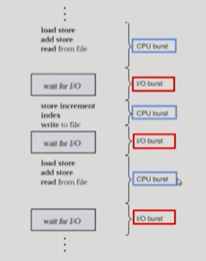
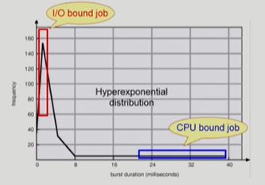

# 🤔 CPU 스케줄링

## CPU Scheduling

### 📕 CPU and I/O Bursts

프로그램을 실행시키면 기본적으로 CPU burst와 I/O burst가 번갈아 가며 일어난다.

CPU가 뭔가 작업을 하고 I/O 작업을 통해 사용자의 입력값을 받고 이러한 절차로 프로그램이 실행되는 것이다.

하지만 시스템의 종류에 따라서는 이 절차의 빈도 및 길이가 다를 수가 있다.

##### ✨ CPU-burst Time의 분포

> ##### 프로세스의 특성 분류
>
> I/O bound job : CPU룰 잡고 계산하는 시간보다 I/O에 많은 시간이 필요한 job (many short CPU bursts)
>
> CPU bound job : CPU만 아주 오랫동안 사용하는 job, 계산 위주의 job (few  very long CPU bursts)

- 여러 종류의 job(=process)이 섞여 있기 때문에 **CPU 스케줄링**이 필요하다.
- Interactive job에게 적절한 response 제공 요망
- CPU와 I/O 장치 등 시스템 자원을 골고루 효율적으로 사용
- CPU 스케줄링 할 때 공평한것도 좋지만 사용자와 자주 인터렉티브 하는 I/O bound job 같은 것에 우선적으로 CPU를 할당하는 것이 필요하다.

### 📘 CPU Scheduler & Dispatcher

##### ✨ CPU Scheduler

> 운영체제 안에서 스케줄링 해주는 특정 코드

- Ready 상태의 프로세스 중에서 이번에 CPU를 줄 프로세스를 고른다.
- CPU 스케줄링이 필요한 경우는 프로세스에게 다음과 같은 상태 변화가 있는 경우다.
  - 1. Running => Blocked (ex. I/O 요청하는 시스템 콜)
  - 2. Running => Ready (ex. 할당시간만료로 timer interrupt)
  - 3. Blocked => Ready (ex. I/O 완료 후 인터럽트)
  - 4. Terminate
  - (1, 4)에서의 스케줄링은 nonpreemptive(=강제로 빼앗지 않고 자진 반납)
  - 다른 것들은 preemptive(=강제로 빼앗음)
    - I/O 작업이 끝난 뒤 인터럽트가 왔을 때 cpu를 사용하고 있는 프로세스가 있을 텐데, 이때 우선순위 스케줄링인 경우 강제로 빼앗아서 I/O작업이 끝난 프로세스에게 넘겨주는 것이 필요하다.

##### ✨ Dispatcher

- CPU의 제어권을 CPU scheduler에 의해 선택된 프로세스에게 넘긴다.
- 이 과정을 context switch(문맥 교환)라고 한다.