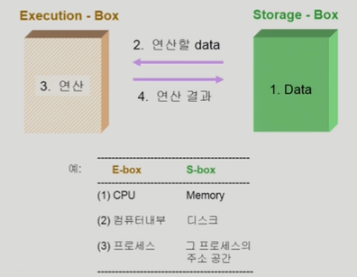
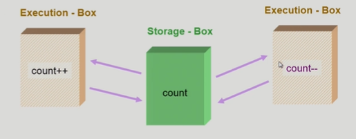

# 🤔 Process Synchronization

### 📕 데이터의 접근

Data를 담고있는 Storage 상자를 하나의 Execution 상자가 사용하면

그냥 데이터를 읽고 연산하고 연산 결과를 저장하면 된다.

하지만, 

이렇게 S-box를 공유하는 E-box가 여럿 있는 경우 Race Condition의 가능성이 생긴다.

(예를 들어, S-box에 1이 저장되어있고 실행하게 되면 E-box들은 1이라는 데이터를 가져간다.
그리고 count++는 1에 더하기를 해서 2를 저장하게되는데,
count--는 1에서 뺄샘을 하여 0을 저장하게 된다.
원래는 1더해지고 1빼지고하여 기존 데이터와 동일한 1이 저장되어야하는데,,
이런 점에서 Race Condition이라는 문제점이 생기게 되는 것이다.)

*Race Condition : 여러 주체가 하나의 데이터를 동시에 접근하려고 할 때, "경쟁상태"

##### ✨ os에서 race condition은 언제 발생하는가?

- kernel 수행 중 인터럽트 발생 시

  

  > 인터럽트가 발생하게 되는데
  > 결과적으로는 1증가한 값을 저장해놓았다가 count--를 실행하고 증가시켜둔 저장된 값을 Store에 반영한다. 즉, Count--는 반영이 안되는 것이다.
  >
  > 이를 해결하기 위해 중요 변수에 접근할 때는 interrupt가 disable되어 끼어들지 못하게 해두고 작업이 끝나면 interrupt가 실행되게 하는 방법이 있다.
  >
  > 커널모드 running중 interrupt가 발생하여 인터럽트 처리루틴이 수행 
  > => 양쪽 다 커널 코드이므로 kernel address space 공유

- Process가 system call을 하여 kernel mode로 수행 중인데 context switch가 일어나는 경우

> u: user, k: kernel
>
> 시스템콜로 인해서 kernel함수를 실행중이던 와중에 context switch가 발생!
>
> 이렇게 되면 A에서 먼저 count값을 불러왔고 실행중이었기 때문에 B의 덧셈이 반영이 되지 않는다.
>
> 결국 A로 할당이 다시 되어 읽어왔던 값을 1증가시킨 다음에 저장하기 때문이다.
>
> 이를 해결하기 위해 커널 모드에서 수행 중일 때는 CPU를 preempt하지 않는다. 즉 뺏지 않는다는 것이다.
> 커널 모드에서 사용자 모드로 돌아갈 때 preempt!
> (이렇게 되면 할당에 있어서 시간 편차가 조금 생기게 된다. A가 조금 더 할당을 많이 받게 된다. 하지만, 시간을 좀 더 줬다 해서 큰 문제가 발생하진 않는다.)

- Multiprocessor에서 shared memory 내의 kernel data

> 어떤 CPU가 마지막으로 count를 store했는가? => race condition
>
> multiprocessor의 경우 interrupt enable/disable로 해결되지 않는다.
>
> 방법1. 한번에 하나의 CPU만이 커널에 들어갈 수 있게 하는 방법
>
> 방법2. 커널 내부에 있는 각 공유 데이터에 접근할 때마다 그 데이터에 대한 lock/unlock을 하는 방법
> (맨 처음 데이터에 접근하여 수정할 때 데이터 자체에 다른 cpu가 접근 못하게 lock을 거는 방법, 그리고 수정 후엔 unlock)

## 🧐 Processor Synchronization

### 📗 Process Synchronization 문제

##### ✨ 공유 데이터(shared data)의 동시 접근은 데이터의 불일치 문제를 발생시킬 수 있다.

##### ✨ 일관성 유지를 위해서는 협력 프로세스간의 실행순서를 정해주는 메커니즘이 필요하다.

##### ✨ Race condition

- 여러 프로세스들이 동시에 공유 데이터를 접근하는 상황
- 데이터의 최종 연산 결과는 마지막에 그 데이터를 다룬 프로세스에 따라 달라진다.

##### ✨race condition을 막기 위해서는 동시접근(concurrent process)은 동기화(synchronize)되어야 한다.

### 📕 The Critical-Section Problem

> Critical-Section(임계구역) : 공유데이터에 접근하는 코드
>
> n개의 프로세스가 공유 데이터를 동시에 사용하기를 원하는 경우 각 프로세서의 code segment에는 공유 데이터를 접근하는 코드인 critical section이 존재한다.

문제점은,

하나의 프로세스가 critical section에 있을 때 다른 모든 프로세스는 critical section에 들어갈 수 없어야 한다.

> 각 공유 데이터에 접근하는 코드인 X=X+1과 X=X-1이 Critical section이 된다.
>
> 그래서 한 프로세스가 공유데이터에 접근하는 Critical section에 들어가면 즉, 공유하는 데이터에 접근하는 코드를 실행중미녀,
> CPU를 뺏겨서 다른 프로세스에 넘어가더라도 공유하는 데이터에 접근하는 critical section에 들어가지 못하게 한다.
>
> critical section에서 빠져 나왔을 때 다른 것에서 접근할 수 있게 된다.
>
> 예를들어 P1에서 접근중일때 CPU가 P2로 넘어가게 되면 이미 critical section을 사용중이기 때문에 코드를 실행하지 못한다.